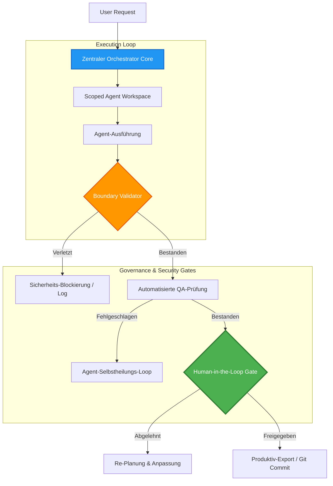

# Wasteland Core Framework: Multi-Agenten-Ausführung & Richtlinien-Engine

Dieses Repository-Modul enthält die Architekturspezifikationen und Dokumentationen für das **Wasteland Core Framework**, dem administrativen Rückgrat des gesamten Multi-Agenten-Ökosystems von Wasteland Interactive.

Das Framework steuert die asynchronen Agenten-Workflows, koordiniert Task-Handoffs, setzt strikte Dateisystem-Sicherheitsgrenzen durch und verwaltet die Human-in-the-Loop-Freigabe-Gates (HITL).

---

## 1. Architektonisches Konzept & Designentscheidungen

Im Gegensatz zu monolithischen Multi-Agenten-Frameworks, die KI-Agenten unkontrollierte Systemrechte zuweisen, setzt das Wasteland Core Framework auf eine **Zero-Trust-Ausführungsrichtlinie**. Agenten arbeiten in streng isolierten Umgebungen und können keine persistenten Dateisystem-Änderungen, API-Requests oder Git-Commits ohne das Passieren automatisierter und menschlicher Kontroll-Gates durchführen.



---

## 2. Zentrale Funktionssäulen

### 2.1 Das Execution-Boundary-Gate (Ausführungsgrenze)
Jeder Agent läuft in einem dedizierten Sandbox-Verzeichnis. Die Komponente `ExecutionBoundary` überwacht Dateisystem-Interaktionen in Echtzeit.
* **Schreibrechte-Kontrolle**: Agenten können ausschließlich in ihrem zugewiesenen Workspace unter `data/workspaces/{agent_id}/` lesen und schreiben.
* **Gesperrte Bereiche**: Der Zugriff auf Systemdateien wie Umgebungsvariablen (`.env`), Hauptverzeichnisse von Entwicklern oder Git-Strukturen (`.git/`) wird auf Framework-Ebene physikalisch blockiert.

### 2.2 Human-in-the-Loop-Freigaben (HITL)
Wasteland Interactive erzwingt eine menschliche Freigabe für alle risikobehafteten Operationen (wie Code-Commits, Live-Deployments oder finanzielle Transaktionen).
* **Das Approval-Package**: Nach Abschluss einer Aufgabe generiert der Agent ein standardisiertes `HumanReviewPackage`:
  1. Eine verständliche Zusammenfassung der Änderungen in natürlicher Sprache.
  2. Einen Git-Diff aller vorgeschlagenen Datei-Änderungen.
  3. Den Ausführungs-Log der automatisierten Unit-Tests (QA).
  4. Eine Risikobewertung der Auswirkungen (Niedrig / Mittel / Hoch).
* **Freigabe-Wege**: Dieses Paket wird über den zentralen Event-Bus an das Admin-Dashboard und den E-Mail-Router gesendet. Das System stoppt die Ausführung, bis eine kryptografisch signierte Freigabe des Managements vorliegt.

### 2.3 Automatisierte Kostenkontrolle (Cost Control)
Um unendliche Inferenz-Schleifen von KI-Agenten zu verhindern (z. B. wenn ein Agent wiederholt fehlerhafte Anfragen stellt und hohe API-Kosten verursacht), überwacht das Modul `CostControl` laufend die Systemmetriken:
* **Token-Budgetierung**: Jeder Session wird ein maximales Token-Budget (z. B. 50.000 Token) zugewiesen.
* **Rekursions-Schutz**: Die Ausführung ist standardmäßig auf maximal 10 Schleifen-Iterationen begrenzt, bevor eine manuelle Fortsetzung erforderlich ist.
* **Finanzielle Guardrails**: Das System bricht die Ausführung ab, sobald die geschätzten API-Kosten vordefinierte Budgets übersteigen.

---

## 3. Abstrahierte Systemimplementierung

Der folgende Pseudocode veranschaulicht, wie der Core-Orchestrator Anfragen verarbeitet und Berechtigungs- sowie HITL-Prüfungen durchsetzt:

```python
# Wasteland Core Framework - Orchestration Gate Logic (Sanitisiertes Modell)

class PermissionGate:
    def __init__(self, workspace_root: str):
        self.workspace_root = workspace_root
        self.sensitive_paths = [".git", ".env", "config/secrets"]

    def validate_file_access(self, target_path: str, operation: str) -> bool:
        """Erzwingt Zero-Trust-Dateizugriffe."""
        resolved_path = os.path.realpath(target_path)
        if not resolved_path.startswith(self.workspace_root):
            return False  # Blockiert Path-Traversal-Versuche
            
        for blocked in self.sensitive_paths:
            if blocked in resolved_path:
                return False  # Zugriff auf sensible Secrets verboten
        return True

class MultiAgentOrchestrator:
    def __init__(self, token_limit: int):
        self.token_tracker = 0
        self.token_limit = token_limit
        self.gate = PermissionGate(workspace_root="/app/workspaces/")

    def execute_agent_step(self, agent_id: str, action: dict) -> dict:
        """Führt einen einzelnen Schritt innerhalb strenger Grenzen aus."""
        if self.token_tracker >= self.token_limit:
            raise BudgetExceededException("Token-Limit überschritten. Ausführung gestoppt.")
            
        # Überprüfe Dateizugriffsrechte im Workspace
        if "target_file" in action:
            if not self.gate.validate_file_access(action["target_file"], action["op"]):
                return {"status": "BLOCKED", "reason": "Sicherheitsrichtlinien-Verletzung"}
                
        # Simuliere Inferenz-Ausführung (anonymisiert)
        result = self._dispatch_to_model(agent_id, action)
        self.token_tracker += result["tokens_used"]
        return {"status": "SUCCESS", "data": result["content"]}

    def request_human_approval(self, proposal: dict) -> bool:
        """Unterbricht die Ausführung und fordert Freigabe des CEOs an."""
        package = self.compile_review_package(proposal)
        token = allie_event_bus.publish("approval.requested", package)
        return allie_event_bus.wait_for_signoff(token, timeout=3600)
```

---

## 4. Tech Stack

* **Sprache**: Python 3.11+
* **Bibliotheken**: `fastapi`, `pydantic` v2 (für robuste Datenschemata), `uvicorn`
* **Orchestrierungs-Basis**: `openai-agents-python` (für strukturiertes Function Calling)
* **Datenbank**: PostgreSQL (für Audit Trails und Session-Statuserhaltung)

---

## 5. Roadmap

* [x] **Zero-Trust-Workspace-Isolation**: Path-Traversal-Erkennung erfolgreich integriert.
* [x] **Kryptografisches HITL-Gateway**: Sichere Signatur-Freigaben über E-Mail/Web.
* [ ] **Kubernetes Sandboxing (Q2 2026)**: Migration von Docker-Verzeichnissen auf kurzlebige, mit gVisor abgesicherte Kubernetes-Namespaces für absolute Sandbox-Isolierung.
* [ ] **Dynamic Prompt Tuning (Q3 2026)**: Dynamische Anpassung des System-Kontexts basierend auf historischen Ausführungsergebnissen.

---

## 6. Redaction Notice

Dieses Verzeichnis abstrahiert die proprietären Python-Klassen des Orchestrators. Alle aktiven Token-Schlüssel sind deaktiviert. Datenbank-Verbindungsdaten, absolute Serverpfade und vertrauliche Prompts wurden durch abstrakte Platzhalter ersetzt.
