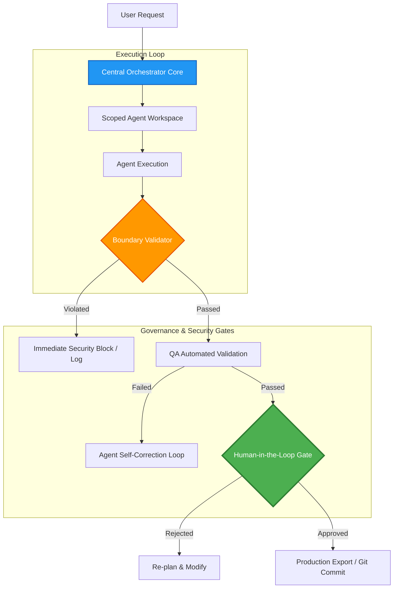

# Wasteland Core Framework: Multi-Agent Execution & Policy Engine

This repository module houses the documentation and architectural specifications for the **Wasteland Core Framework**, the administrative skeleton of Wasteland Interactive's multi-agent ecosystem. 

The framework is responsible for coordinating workflow state, executing task handoffs, enforcing strict permission boundaries, and managing Human-in-the-Loop (HITL) approval gates.

---

## 1. Architectural Blueprint & Design Rationale

Unlike monolithic multi-agent frameworks that delegate extensive autonomy to agents without governance, the Wasteland Core Framework implements a **Zero-Trust execution policy**. Agents are isolated within scoped boundaries and cannot perform disk changes, make external network requests, or commit code without passing through structured verification gates.



---

## 2. Core Functional Pillars

### 2.1 The Execution Boundary Gate
Every agent runs inside a sandboxed virtual directory. The `ExecutionBoundary` monitors filesystem operations in real-time. 
* **Write Access Controls**: Agents can only read and write within their designated directory under `data/workspaces/{agent_id}/`. 
* **Forbidden Scopes**: Direct access to system environment files (`.env`), developer directories, or repository configuration roots (e.g. `.git/`) is physically restricted at the framework layer.

### 2.2 Human-in-the-Loop (HITL) Approvals
Wasteland enforces human-in-the-loop governance for all high-risk operations (such as committing code, updating live websites, or executing cryptocurrency operations).
* **The Approval Package**: When an agent completes an operation, it compiles a structured `HumanReviewPackage` containing:
  1. A clear natural language summary of what changed.
  2. A git-style file diff of all proposed file edits.
  3. A quality assurance execution log showing unit tests passed.
  4. An impact risk review (Low / Medium / High).
* **Approval Routes**: The package is dispatched via the Event Bus to either the Web Dashboard or ALLIE's priority email router. The system halts progress until a cryptographic approval token is received from the CEO.

### 2.3 Automated Cost Control Layer
To prevent LLM "infinite loops" (where agents repeatedly query models and exhaust API limits), the `CostControl` component monitors runtime metrics:
* **Token Budgeting**: A maximum token allocation is assigned per session (e.g., 50,000 tokens).
* **Step Limiting**: Execution is hard-limited to a maximum number of recursive steps (e.g., 10 iterations) before requiring explicit human continuation.
* **Financial Guardrails**: A budget tracker halts execution if the estimated API cost exceeds set thresholds.

---

## 3. Abstract System Implementation

The following pseudocode outlines how the core orchestrator processes tasks through permission and human approval gates:

```python
# Wasteland Core Framework - Orchestration Gate Logic (Sanitized Abstract Model)

class PermissionGate:
    def __init__(self, workspace_root: str):
        self.workspace_root = workspace_root
        self.sensitive_paths = [".git", ".env", "config/secrets"]

    def validate_file_access(self, target_path: str, operation: str) -> bool:
        """Enforces Zero-Trust file access policies."""
        resolved_path = os.path.realpath(target_path)
        if not resolved_path.startswith(self.workspace_root):
            return False  # Path traversal attempt blocked
            
        for blocked in self.sensitive_paths:
            if blocked in resolved_path:
                return False  # Access to system secrets forbidden
        return True

class MultiAgentOrchestrator:
    def __init__(self, token_limit: int):
        self.token_tracker = 0
        self.token_limit = token_limit
        self.gate = PermissionGate(workspace_root="/app/workspaces/")

    def execute_agent_step(self, agent_id: str, action: dict) -> dict:
        """Executes a single step within the strict execution boundaries."""
        if self.token_tracker >= self.token_limit:
            raise BudgetExceededException("API budget limit reached. Execution halted.")
            
        # Validate workspace file accesses
        if "target_file" in action:
            if not self.gate.validate_file_access(action["target_file"], action["op"]):
                return {"status": "BLOCKED", "reason": "Security Boundary Violation"}
                
        # Simulate LLM Execution (Sanitized)
        result = self._dispatch_to_model(agent_id, action)
        self.token_tracker += result["tokens_used"]
        return {"status": "SUCCESS", "data": result["content"]}

    def request_human_approval(self, proposal: dict) -> bool:
        """Halts execution and requests cryptographic signoff from CEO."""
        package = self.compile_review_package(proposal)
        token = allie_event_bus.publish("approval.requested", package)
        return allie_event_bus.wait_for_signoff(token, timeout=3600)
```

---

## 4. Tech Stack

* **Language**: Python 3.11+
* **Dependencies**: `fastapi`, `pydantic` v2 (for robust data validation), `uvicorn`
* **Orchestration Base**: `openai-agents-python` (for foundational function calling)
* **Storage**: PostgreSQL (for tracking system states and audit trails)

---

## 5. Development Roadmap

* [x] **Zero-Trust Workspace Isolation**: Implemented path traversal prevention algorithms.
* [x] **Cryptographic HITL Gateway**: Secured verification tokens for email/web approval.
* [ ] **Kubernetes Sandboxing (Q2 2026)**: Migrate from Docker local folders to ephemeral gVisor-secured Kubernetes namespaces for absolute agent isolation.
* [ ] **Automated Dynamic Prompt Tuning (Q3 2026)**: Tune agents' context dynamically based on historical execution performance.

---

## 6. Redaction Notice

This directory abstracts the proprietary Python classes of the orchestrator, and all active cryptographic approval tokens are disabled. Database connection strings, system file paths, and private prompt instructions are replaced with abstract structures.
