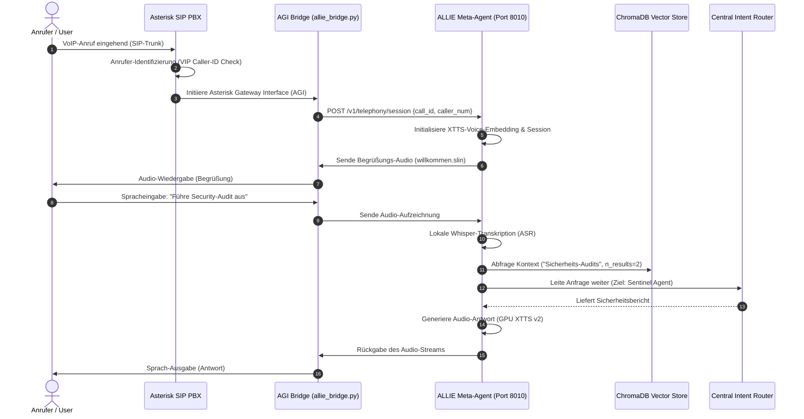

# ALLIE Meta-Orchestrator: Conversational Telephony & Multi-Agent Routing Hub

Dieses Repository-Modul präsentiert die Architektur und die technische Implementierung von **ALLIE**, dem zentralen Meta-Agenten und Orchestrierungs-Hub des gesamten Ökosystems von Wasteland Interactive.

ALLIE dient als primäre Benutzeroberfläche und integriert Telefonie-Netzwerke, maßgeschneiderte Deep-Learning-Sprachsynthese (TTS), semantische Suchen (RAG) und asynchrones E-Mail-Management in ein einheitliches, sprachgesteuertes System.

---

## 1. Systemarchitektur & Telefonie-Routing

ALLIE ist als Multi-Channel-Orchestrierungsschicht konzipiert. Das System verarbeitet eingehende VoIP-Anrufe über eine Asterisk-SIP-Telefonanlage, klassifiziert den Benutzer-Intent, führt semantische RAG-Suchen in ChromaDB aus und leitet die Anfragen an spezialisierte Sub-Agenten weiter.



---

## 2. Zentrale funktionale Komponenten

### 2.1 Die Conversational Telephony Engine (Telefonie)
ALLIE ist direkt an eine selbstgehostete Asterisk-Telefonanlage angebunden, die über einen sicheren SIP/PJSIP-Trunk an den VoIP-Provider (Easybell) angebunden ist.
* **SIP-Transport**: Die Übertragung erfolgt verschlüsselt über TCP, um maximale Paketzuverlässigkeit zu garantieren.
* **AGI Bridge (`allie_bridge.py`)**: Ein asynchrones Python-Script, das als Brücke zwischen dem Asterisk-Dialplan und ALLIEs API fungiert. Es verarbeitet Anrufannahmen (ANSWER), DTMF-Tastentöne und Echtzeit-Audiostreams.
* **Smart IVR System**: Ein intelligentes, 6-stufiges Sprachmenü mit dynamic VIP-Erkennung. Anrufe von priorisierten Rufnummern werden automatisch personalisiert begrüßt und bevorzugt an Sicherheitsaudits oder den CEO weitergeleitet.

### 2.2 Deep-Learning-Sprachinferenz (XTTS & Whisper)
Um eine menschliche und flüssige Interaktion zu ermöglichen, nutzt ALLIE keine Cloud-Dienste, sondern betreibt eine vollständig lokale, GPU-beschleunigte Audio-Pipeline:
* **Finetuned XTTS v2-Modell**: Ein lokal trainiertes XTTS-Modell, das auf ALLIEs Stimme optimiert wurde. Vorberechnete Sprach-Embeddings (`allie_embeddings.pt`) werden beim Systemstart direkt in den VRAM geladen, um Inferenzlatenzen zu minimieren.
* **Whisper Speech-To-Text**: Verwendet ein lokales Whisper-Modell zur Transkription von Spracheingaben und aufgezeichneten Mailbox-Nachrichten.

### 2.3 Lokaler RAG-Wissensspeicher
ALLIE ist mit einer selbstgehosteten ChromaDB-Instanz verknüpft. Bei einer Benutzeranfrage sucht das System nach relevanten Dokumenten (z. B. System-Betriebshandbücher, Projektdokumente), um präzise und kontextbezogene Antworten zu generieren und KI-Halluzinationen zu verhindern.

### 2.4 Asynchroner E-Mail-Router
Das System scannt kontinuierlich eingehende Support- und Betriebs-E-Mails.
* **Intent-Analyse**: Mittels lokaler LLMs werden E-Mails nach Dringlichkeit (Priorität 1 bis 5) klassifiziert.
* **Krisen-Routings**: E-Mails ab `Priorität >= 5` (z. B. Serverausfälle, kritische Anfragen) umgehen reguläre Workflows, lösen sofortige Administrator-Alerts aus und generieren automatisch Antwortentwürfe, die auf eine manuelle Freigabe warten.

---

## 3. Asterisk Dialplan-Konfiguration

Der folgende, sanitisierte Dialplan zeigt, wie eingehende Anrufe an ALLIEs AGI-Bridge übergeben werden:

```ini
; telephony/asterisk/config/extensions.conf (Sanitisiert)

[general]
static=yes
writeprotect=yes

[from-external-sip]
; Leite eingehende Trunk-Anrufe an das ALLIE Voice Gateway weiter
exten => s,1,NoOp("Eingehender Anruf auf sicherem SIP-Trunk")
exten => s,n,Answer()
exten => s,n,Playback(silence/1)
exten => s,n,AGI(agi://localhost:4573/allie_bridge.py)
exten => s,n,Hangup()

; Fallback-Bereinigung nach dem Auflegen
exten => h,1,NoOp("Anruf beendet. Starte Session-Bereinigung.")
exten => h,n,AGI(agi://localhost:4573/allie_bridge.py,cleanup)
```

---

## 4. Tech Stack

* **API-Infrastruktur**: FastAPI (Python), `pydantic`
* **VoIP-Telefonie**: Asterisk PBX, PJSIP, Python AGI-Bibliothek
* **Audio-Inferenz**: PyTorch, Coqui XTTS v2, OpenAI Whisper (NVIDIA CUDA beschleunigt)
* **Vektordatenbank**: ChromaDB
* **Schnittstellen**: IMAP/SMTP Mail-Clients, Google Calendar API

---

## 5. Roadmap

* [x] **VoIP-Integration**: Erfolgreiche SIP-Registrierung über TCP und NAT-Traversal über Router-Freigaben.
* [x] **Eigene Stimme**: XTTS v2-Inferenz läuft lokal mit vorab berechneten Embeddings auf CUDA.
* [ ] **Echtzeit-Audio-Streaming (Q2 2026)**: Umstellung auf bidirektionale WebSockets (WebSocket TTS / streaming ASR), um die Antwortlatenz auf unter 800ms zu senken.
* [ ] **Mehrsprachigkeit (Q3 2026)**: Automatische Spracherkennung des Anrufers während des Gesprächs und On-the-fly-Wechsel der XTTS-Sprachgewichte.

---

## 6. Redaction Notice

Dieses Projekt-Modul enthält keine echten SIP-Zugangsdaten, privaten Telefonnummern, SMTP-Passwörter oder absoluten Systempfade. Die proprietären Audio-Trainingsdatensätze und Rohdateien zur Stimmenklonung wurden aus datenschutzrechtlichen Gründen entfernt.
