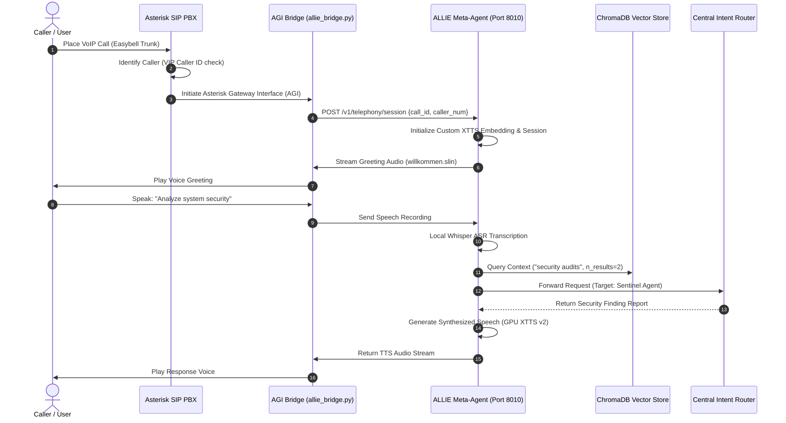

# ALLIE Meta-Orchestrator: Conversational Telephony & Multi-Agent Routing Hub

This repository module presents the architecture and engineering implementation of **ALLIE**, the central Meta-Agent and Orchestration Hub of the Wasteland Interactive ecosystem. 

ALLIE serves as our primary user interface, integrating legacy telephony networks, custom deep-learning voice synthesis, local semantic search (RAG), and async email dispatch into a unified conversational system.

---

## 1. System Architecture & Telephony Routing

ALLIE is designed as a multi-channel orchestration layer. It handles real-time voice calls via an Asterisk SIP PBX, classifies user intent, performs RAG searches in ChromaDB, and routes execution to specialized sub-agents.



---

## 2. Core Operational Modules

### 2.1 The Conversational Telephony Engine
ALLIE is directly connected to a self-hosted Asterisk PBX integrated with a secure SIP/PJSIP trunk provider. 
* **SIP Transport**: Configured strictly over secure TCP pipelines to guarantee voice transport reliability.
* **AGI Bridge (`allie_bridge.py`)**: An asynchronous Python script acting as the mediator between Asterisk's dialplan and ALLIE’s API. It handles call answer commands, DTMF keypress processing, and real-time audio streaming.
* **Smart IVR System**: Features a 6-tier interactive voice response menu with dynamic VIP caller recognition. Key entries route users dynamically to IT-Security audits, business consulting, or priority agent callbacks.

### 2.2 Deep-Learning Voice & Media Inference
To deliver highly natural human-grade voice response, ALLIE bypasses standard cloud TTS services in favor of an offline, GPU-accelerated speech pipeline:
* **XTTS v2 Voice Model**: A localized, fine-tuned XTTS v2 voice model trained on high-quality speaker samples. Precomputed embeddings (`allie_embeddings.pt`) are loaded directly into VRAM on startup for ultra-low latency inference.
* **Speech-To-Text**: Uses OpenAI's Whisper model locally to transcribe callers' speech and recorded voicemails, yielding clean textual inputs for the LLM router.

### 2.3 Local Semantic Memory (RAG)
ALLIE is integrated with a self-hosted ChromaDB vector database. When a request is received, ALLIE retrieves context-specific documentation (such as product specs, internal operations manuals, or client details) to ground its responses, avoiding AI hallucinations.

### 2.4 Asynchronous Email Router
ALLIE constantly polls incoming support and operations mailboxes.
* **Intent Analysis**: Using local LLMs, it grades incoming threads by priority (1 to 5) and intent.
* **Crisis Management**: Emails marked with `Priority >= 5` (e.g. server failures, urgent investor requests) bypass normal queues, trigger push alerts, and auto-generate draft replies ready for human approval.

---

## 3. Telephony Configuration & Routing Schema

The following sanitized Asterisk dialplan snippet outlines how incoming calls are routed into ALLIE's AGI Bridge:

```ini
; telephony/asterisk/config/extensions.conf (Sanitized Dialplan)

[general]
static=yes
writeprotect=yes

[from-external-sip]
; Route incoming trunk calls to ALLIE Interactive Voice Gateway
exten => s,1,NoOp("Incoming Call received via secure SIP trunk")
exten => s,n,Answer()
exten => s,n,Playback(silence/1)
exten => s,n,AGI(agi://localhost:4573/allie_bridge.py)
exten => s,n,Hangup()

; Fallback priority callback routing
exten => h,1,NoOp("Call closed. Initiating post-call session cleanup.")
exten => h,n,AGI(agi://localhost:4573/allie_bridge.py,cleanup)
```

---

## 4. Tech Stack

* **API Backbone**: FastAPI (Python), `pydantic`
* **VoIP Telephony**: Asterisk PBX, PJSIP, Python AGI Library
* **Deep Learning Inference**: PyTorch, Coqui XTTS v2, Whisper (NVIDIA CUDA accelerated)
* **Vector Storage**: ChromaDB
* **Integrations**: IMAP/SMTP, Google Calendar API

---

## 5. Development Roadmap

* [x] **VoIP Integration**: SIP Trunk TCP registration and NAT traversal configured.
* [x] **Custom Voice Model**: Coqui XTTS v2 fine-tuned model running locally with precomputed embeddings.
* [ ] **Ultra-low latency streaming (Q2 2026)**: Implement WebSocket-based streaming (WebSocket TTS / streaming ASR) to reduce voice-to-voice response delay to under 800ms.
* [ ] **Multilingual Telephony (Q3 2026)**: Dynamically detect caller language on-the-fly and load corresponding XTTS language weights.

---

## 6. Redaction Notice

This project module excludes all active SIP registrar credentials, private phone numbers, mail server API tokens, and local path variables. Proprietary neural network training configurations and the raw voice cloning samples have been redacted.
