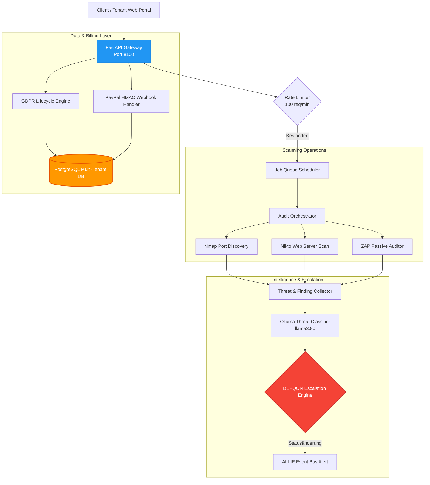

# Sentinel Security Auditor: Automatisierte Schwachstellen-Audits & GDPR-SaaS-Compliance

Dieses Repository-Modul beschreibt die Architektur und Systemstruktur von **Sentinel**, einer produktionsbereiten, mandantenfähigen (SaaS) Sicherheitsprüfungs- und kontinuierlichen Überwachungsplattform.

Sentinel fungiert als automatisierter Wächter unserer Infrastruktur. Die Plattform kombiniert bewährte Tools zur Sicherheitsanalyse mit lokalen LLMs zur Bedrohungsbewertung, forensischer Protokollierung, automatisierter GDPR-Compliance und einem dynamischen Eskalationsrahmen (dem DEFQON-System).

---

## 1. Architektonische Systemübersicht

Sentinel ist als entkoppelter, sicherer Multi-Tenant-Microservice konzipiert. Der Service stellt ein API-Gateway bereit, das automatisierte Netzwerk-Audits koordiniert, SaaS-Abrechnungs-Webhooks empfängt und globale Bedrohungsstufen verwaltet.



---

## 2. Zentrale Funktionssäulen

### 2.1 Pipeline für automatisierte Schwachstellen-Audits
Sentinel steuert und delegiert zerstörungsfreie Sicherheitsüberprüfungen:
* **Port- & Service-Erkennung**: Integriert `Nmap` zur Erkennung offener Ports, aktiver Service-Versionen und zur Prüfung von Firewall-Regeln.
* **Server-Analysen**: Nutzt `Nikto` zur Identifizierung veralteter Serverkonfigurationen, gefährlicher Standarddateien und unsicherer CGI-Konfigurationen.
* **Web-Applikations-Audits**: Koordiniert `OWASP ZAP` (passive Prüfungen) zur Erkennung gängiger Schwachstellen (wie SQLi, XSS, CSRF und unsichere CORS-Einstellungen).
* **KI-Bedrohungsberichte**: Ein lokales `llama3:8b`-Modell analysiert die rohen Logdateien und generiert verständliche Berichte mit konkreten Handlungsempfehlungen.

### 2.2 Dynamisches Bedrohungs-Eskalationssystem (DEFQON)
Sentinel überwacht Host-Audit-Logs und Anomalien im Netzwerk, um den globalen Sicherheitsstatus des Systems in 6 Eskalationsstufen zu steuern:
* **DEFQON-Stufen**:
  * `5` / **Normal**: Standardbetrieb.
  * `4` / **Elevated**: Leichte Anomalien (z. B. erhöhte Port-Scans).
  * `3` / **Alert**: Bestätigte Schwachstelle auf unkritischen Systemen.
  * `2` / **High**: Unberechtigte Dateisystem-Aktivitäten detektiert.
  * `1` / **Maximum**: Aktiver Sicherheitsvorfall oder Boundary-Verletzung.
  * `W` / **Warning**: Sofortiger Wartungsmodus / Lockdown-Fallback.
* **ALLIE-Bridge**: Jede Änderung des DEFQON-Status sendet ein signiertes JSON-Paket an ALLIEs Event-Bus, um Systemadministratoren über Push-Meldungen, Anrufe oder E-Mails zu alarmieren.

### 2.3 SaaS-Readiness & Webhook-Integration
Sentinel verfügt über ein transaktionales Abonnement-Modell mit drei Stufen:
* **Tarif-Übersicht**:
  * **Starter (€199/Monat)**: 3 Zielsysteme, 120s Scan-Timeout, grundlegende Audits.
  * **Pro (€699/Monat)**: 10 Zielsysteme, 300s Timeout, inkl. authentifizierter Scans.
  * **Enterprise (€1999/Monat)**: 50 Zielsysteme, 600s Timeout, inkl. API-Audits.
* **PayPal-Integration**: Webhooks verarbeiten Zahlungen sicher über kryptografische HMAC-SHA256-Signaturprüfungen, bevor Abonnements freigeschaltet werden.
* **Mandantentrennung**: Alle Datenbankzugriffe sind über eindeutige `tenant_id`-Sitzungsschlüssel auf Abfrageebene streng voneinander isoliert.

### 2.4 GDPR / DSGVO-Compliance-Engine
Zum Schutz sensibler Benutzerdaten enthält Sentinel eine native Datenschutz-Engine:
* **Soft Deletes**: Datenbanken nutzen Kaskaden-Löschkonzepte zur Aufbewahrung von Audit-Daten bei gleichzeitiger Entfernung personenbezogener Daten.
* **Einwilligungs-Protokollierung**: Nutzer-Consents werden manipulationssicher in signierten Logs gespeichert.
* **Automatisierter Datenexport**: Ermöglicht den automatischen Export personenbezogener Daten im JSON-/CSV-Format gemäß DSGVO Artikel 15 (Recht auf Datenübertragbarkeit).

---

## 3. Abstrahierte Logik: Webhook-Verifizierung & DEFQON-Evaluation

Der folgende, sanitisierte Python-Code zeigt die Implementierung von Sentinels kryptografischer Webhook-Prüfung und Bedrohungs-Klassifizierung:

```python
# Sentinel Security Auditor - Security & Event Verification (Sanitisiertes Modell)

import hmac
import hashlib

class WebhookAuthenticator:
    def __init__(self, webhook_secret: bytes):
        self.webhook_secret = webhook_secret

    def verify_paypal_signature(self, payload: bytes, signature_header: str) -> bool:
        """Verifiziert die Authentizität eingehender Zahlungs-Webhooks mittels HMAC-SHA256."""
        if not signature_header:
            return False
            
        # Berechne die erwartete kryptografische Signatur
        computed_sig = hmac.new(
            self.webhook_secret,
            msg=payload,
            digestmod=hashlib.sha256
        ).hexdigest()
        
        return hmac.compare_digest(computed_sig, signature_header)

class DefqonEscalator:
    def __init__(self, initial_level: str = "5"):
        self.current_level = initial_level

    def evaluate_threat(self, scan_report: dict) -> str:
        """Klassifiziert den DEFQON-Status basierend auf den Schwachstellen-Scans."""
        critical_count = sum(1 for f in scan_report.get("findings", []) if f["severity"] == "CRITICAL")
        high_count = sum(1 for f in scan_report.get("findings", []) if f["severity"] == "HIGH")
        
        # Bedrohungs-Klassifizierung
        if critical_count > 0:
            new_level = "2"  # DEFQON 2 - High Threat
        elif high_count >= 3:
            new_level = "3"  # DEFQON 3 - Alert State
        else:
            new_level = "5"  # DEFQON 5 - Normal
            
        if new_level != self.current_level:
            self.current_level = new_level
            self.dispatch_escalation_event(new_level)
            
        return self.current_level

    def dispatch_escalation_event(self, level: str):
        """Erzeugt und signiert die ALLIE-Bridge-Event-Payload."""
        payload = {
            "source": "sentinel",
            "event_type": "DEFQON_CHANGE",
            "defqon_level": level,
            "timestamp": "2026-05-25T18:00:00Z"
        }
        # Praktische Umsetzung: Sende JSON an den sicheren Event-Bus von ALLIE
        print(f"DEFQON-Status geändert auf {level}. Sende Alert an den Event-Bus.")
```

---

## 4. Tech Stack

* **Web-Framework**: FastAPI (Python), `uvicorn`, `pydantic`
* **Datenbanken**: PostgreSQL (relationale Datenbank), ChromaDB (RAG-Audit-Protokolle)
* **Hilfsprogramme**: Nmap, Nikto, OWASP ZAP (CLI-Integrationen)
* **Betrieb & Monitoring**: Prometheus Metrics Export, Docker Compose Multi-Stage-Builds
* **Bibliotheken**: `cryptography` (bcrypt, HMAC-Signaturen), `requests`

---

## 5. Roadmap

* [x] **Compliance-Engine**: DSGVO-Soft-Delete-Modelle und Datenexport-Scripts implementiert.
* [x] **PayPal-Webhook-Prüfung**: Kryptografisch validierter HMAC-SHA256 Event-Parser einsatzbereit.
* [ ] **Intelligente, aktive Behebung (Q2 2026)**: Verknüpfung der Sentinel-Schwachstellenberichte mit dem Offline Coding Agent zur vollautomatischen Generierung sicherer Bugfixes direkt nach Entdeckung von Lücken.
* [ ] **Verteilte Scan-Knoten (Q3 2026)**: Horizontale Skalierung von Scan-Workloads auf entfernte, flüchtige Instanzen über verschlüsselte WireGuard-Tunnel.

---

## 6. Redaction Notice

Dieses Projekt-Verzeichnis enthält keine produktiven Datenbankpasswörter, aktiven Webhook-Secrets, realen Ziel-IP-Adressen oder echten Exploit-Payloads. Sämtliche Scanner laufen unter standardisierten Testkonfigurationen.
