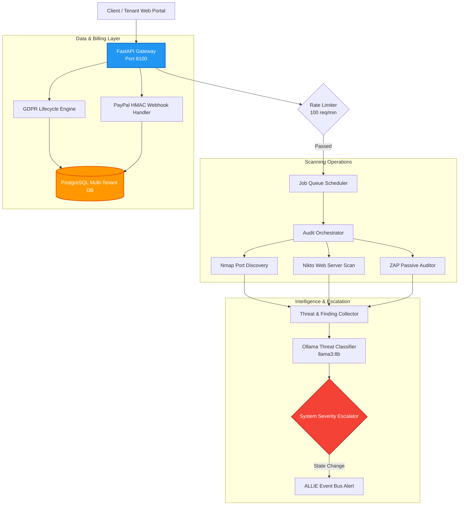

# Sentinel Security Auditor: Automated Vulnerability & GDPR SaaS Compliance Platform

This repository module showcases the architecture of **Sentinel**, an advanced modular SaaS prototype for automated security auditing and continuous monitoring. 

Sentinel serves as a continuous validation component of our infrastructure, combining industry-standard vulnerability scanning utilities with local LLM threat assessment, forensic logging, GDPR compliance enforcement, and a system severity level escalation engine.

---

## 1. Architectural System Overview

Sentinel is designed as a decoupled, secure multi-tenant microservice. It exposes a rate-limited API gateway that schedules automated network audits, processes SaaS billing webhooks, and broadcasts system severity levels.



---

## 2. Core Functional Pillars

### 2.1 Automated Vulnerability Scanning Pipeline
Sentinel schedules and executes non-destructive security audits:
* **Infrastructure Discovery**: Integrates `Nmap` for secure port scanning, service version detection, and firewall rule auditing.
* **Server Scans**: Leverages `Nikto` to detect outdated server configurations, dangerous default files, and insecure CGI installations.
* **Web Application Testing**: Coordinates `OWASP ZAP` passive checks to identify common vulnerabilities (SQLi, XSS, CSRF, insecure CORS policies).
* **LLM-Enhanced Summaries**: The raw log findings are parsed by a local `llama3:8b` model to generate human-readable security risk summaries and step-by-step mitigation advice.

### 2.2 System Severity Level Escalation Engine
Sentinel monitors host audit logs and network intrusion indicators to maintain a global system severity level classification containing 6 escalation stages:
* **System Severity Levels**:
  * `5` / **Normal**: Standard daily operations.
  * `4` / **Elevated**: Minor anomaly indicators (increased port scans).
  * `3` / **Alert**: Validated vulnerability discovered on non-critical targets.
  * `2` / **High**: Out-of-bounds filesystem actions detected.
  * `1` / **Critical**: Active security breach or root boundary violation.
  * `W` / **Lockdown**: Immediate maintenance fallback or container isolations.
* **ALLIE Bridge**: Any state transition triggers a signed JSON payload dispatched to ALLIE’s Event Bus, notifying system administrators via push alerts, phone triggers, or automated email drafts.

### 2.3 SaaS Readiness & Webhook Orchestration
Sentinel features a transactional subscription model supporting three conceptual tiers:
* **Subscription Tiers**:
  * **Starter (€199/mo)**: 3 target hosts, 120s scan timeout, basic auditing.
  * **Pro (€699/mo)**: 10 target hosts, 300s timeout, adds authenticated scanning.
  * **Enterprise (€1999/mo)**: 50 target hosts, 600s timeout, advanced API testing.
* **PayPal Integration**: Webhooks process SaaS payments using rigorous HMAC cryptographic signature checks to verify authenticity before provisioning resources.
* **Tenant Segregation**: Access controls are strictly enforced at the database query layer via scoped `tenant_id` session keys.

### 2.4 GDPR & CCPA Compliance Gateways
To guarantee the highest data privacy standards, Sentinel features a native privacy lifecycle engine:
* **Soft Deletes**: Active databases implement cascading soft-deletion models to preserve audit records while removing personal data.
* **Consent Audits**: User consent settings are tracked in cryptographically signed audit logs.
* **Automated Data Export**: Provides automated JSON/CSV personal data packaging tools to fulfill GDPR Article 15 Data Portability requests.

---

## 3. Abstract Logic: Event Verification & Webhook Authentication

The following abstract Python script illustrates Sentinel’s approach to cryptographically validating external payment webhooks and processing severity alerts:

```python
# Sentinel Security Auditor - Security & Event Verification (Sanitized Model)

import hmac
import hashlib

class WebhookAuthenticator:
    def __init__(self, webhook_secret: bytes):
        self.webhook_secret = webhook_secret

    def verify_paypal_signature(self, payload: bytes, signature_header: str) -> bool:
        """Verifies payment webhook authenticity using HMAC-SHA256."""
        if not signature_header:
            return False
            
        # Compute expected cryptographic signature
        computed_sig = hmac.new(
            self.webhook_secret,
            msg=payload,
            digestmod=hashlib.sha256
        ).hexdigest()
        
        return hmac.compare_digest(computed_sig, signature_header)

class SeverityLevelEscalator:
    def __init__(self, initial_level: str = "5"):
        self.current_level = initial_level

    def evaluate_threat(self, scan_report: dict) -> str:
        """Determines the system severity state based on automated audit findings."""
        critical_count = sum(1 for f in scan_report.get("findings", []) if f["severity"] == "CRITICAL")
        high_count = sum(1 for f in scan_report.get("findings", []) if f["severity"] == "HIGH")
        
        # Threat evaluation heuristics
        if critical_count > 0:
            new_level = "2"  # Severity 2 - High Threat
        elif high_count >= 3:
            new_level = "3"  # Severity 3 - Alert State
        else:
            new_level = "5"  # Severity 5 - Normal
            
        if new_level != self.current_level:
            self.current_level = new_level
            self.dispatch_escalation_event(new_level)
            
        return self.current_level

    def dispatch_escalation_event(self, level: str):
        """Constructs and signs the ALLIE Bridge alert payload."""
        payload = {
            "source": "sentinel",
            "event_type": "SEVERITY_LEVEL_CHANGE",
            "severity_level": level,
            "timestamp": "2026-05-25T18:00:00Z"
        }
        # In practice: Post signed JSON to ALLIE's secure Event Bus
        print(f"System Severity Level Changed to {level}. Dispatching alert to Event Bus.")
```

---

## 4. Tech Stack

* **Web Framework**: FastAPI (Python), `uvicorn`, `pydantic`
* **Databases**: PostgreSQL (Relational store), ChromaDB (RAG contextual logs)
* **Underlying Utilities**: Nmap, Nikto, OWASP ZAP (CLI bindings)
* **Operations & Monitoring**: Prometheus metrics export, Docker Compose multi-stage containers
* **Libraries**: `cryptography` (bcrypt hashing, HMAC signers), `requests`

---

## 5. Development Roadmap

* [x] **Compliance Engine**: Implemented GDPR soft-delete paradigms and export scripts.
* [x] **PayPal Webhook Gateway**: Crypto-validated HMAC-SHA256 event parser.
* [ ] **Intelligent Active Remediation (Q2 2026)**: Integrate Sentinel alerts directly with the Offline Coding Agent to automatically generate secure hotfix proposals when web vulnerabilities are detected.
* [ ] **Distributed Scanning Agents (Q3 2026)**: Deploy scanning workloads horizontally onto lightweight, transient remote nodes using WireGuard network tunnels.

---

## 6. Redaction Notice

This project folder does not contain live operational database passwords, active webhook signing keys, specific network IP address targets, or real exploit payloads. All passive scanners run with standard test configurations.
