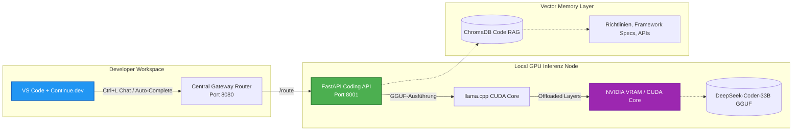

# Offline Coding Agent: GPU-beschleunigte lokale Code-Inferenz & RAG-System

Dieses Repository-Modul beschreibt die Systemarchitektur und lokale Docker-Konfiguration des **Wasteland Offline Coding Agents**, unseres selbstgehosteten, GPU-beschleunigten Assistenten für Code-Intelligenz.

Das System arbeitet vollständig offline und integriert spezialisierte Deep-Learning-Modelle mit ChromaDB-Vektorsuchen und nativen Entwicklungsumgebungen (IDEs). Dadurch wird erstklassige Entwickler-Unterstützung gewährleistet, ohne dass Quellcode das lokale Netzwerk verlässt.

---

## 1. Architektonische Systemübersicht

Der Coding Agent ist für den Betrieb auf lokalen Workstation-GPUs (z. B. RTX 2070 Super oder RTX 4090er-Serie) optimiert. Das System stellt eine OpenAI-kompatible Schnittstelle zur Verfügung, die Auto-Complete- und Chat-Anfragen direkt in der IDE verarbeitet.



---

## 2. Zentrale Funktionssäulen

### 2.1 Quantisierter lokaler LLM-Server (`llama.cpp`)
Um laufende SaaS-API-Kosten für Code-Modelle zu eliminieren und den Schutz proprietären Quellcodes physisch zu garantieren, läuft der Coding Agent komplett offline:
* **Quantisiertes Modell**: Verwendet die leistungsstarken Modelle `deepseek-coder-33b-instruct.Q4_K_M.gguf` und `deepseek-coder-6.7b-instruct.Q4_K_M.gguf`.
* **GPU-CUDA-Beschleunigung**: Containerisiert über offizielle `nvidia/cuda`-Images. Das Modul kompiliert `llama-cpp-python` mit CUDA-BLAS-Unterstützung (`DLLAMA_CUBLAS=on`), um LLM-Layer direkt in den Grafikspeicher (VRAM) auszulagern (auf RTX 2070 Super sind 43 Layer ausgelagert; Context-Window: 8192 Token).

### 2.2 RAG-gestützte Code-Kontextualisierung
Um zu verhindern, dass die KI veraltete oder fehlerhafte Code-Strukturen vorschlägt, nutzt das System eine RAG-Pipeline (Retrieval-Augmented Generation):
* **Lokale Ingestion**: System-Dokumentationen, Clean-Code-Richtlinien und API-Spezifikationen sind als Vektoren in ChromaDB gespeichert.
* **Semantische Suche**: Bei Entwickler-Fragen werden vor der Modell-Inferenz relevante Dokumentations-Ausschnitte abgerufen und dem System-Prompt beigefügt.

### 2.3 Integration in Entwicklungsumgebungen (IDE Bridge)
Das System dient als Drop-in-Ersatz für kommerzielle Programmier-Assistenten:
* **Continue.dev-Integration**: Konfiguriert über eine lokale VS-Code-Konfigurationsdatei (`continue-config.json`). Bietet Tab-Autocomplete, Code-Erklärung, Fehlerbehebung und Unit-Test-Erstellung direkt über den lokalen Docker-Orchestrator.
* **OpenAI-API-Kompatibilität**: Exponiert standardisierte `/v1/completions`-Endpunkte zur nahtlosen Anbindung von Command-Line-Editoren oder automatisierten Skripten.

---

## 3. Konfigurations-Blaupausen

### 3.1 Docker Compose Deployment (Sanitisiert)
Die folgende Konfiguration zeigt die GPU-Durchreichung und die schreibgeschützte Einbindung des Modells im Container:

```yaml
# docker-compose.yml (Sanitisiertes GPU-Inferenz-Setup)

version: '3.8'

services:
  wasteland-coding:
    build:
      context: ./agents/coding
    container_name: wasteland-coding
    deploy:
      resources:
        reservations:
          devices:
            - driver: nvidia
              count: all
              capabilities: [gpu]
    networks:
      - internal_llm_net
    environment:
      - CUDA_VISIBLE_DEVICES=0
      - MODEL_PATH=/models/deepseek-coder-33b-instruct.Q4_K_M.gguf
    restart: unless-stopped
    volumes:
      - /host/models:/models:ro  # Schreibgeschützter Mount
    healthcheck:
      test: ["CMD", "curl", "-f", "http://localhost:8001/health"]
      interval: 60s
      timeout: 30s
      retries: 3
```

### 3.2 VS Code Continue.dev-Konfigurationsvorlage
Die IDE-Konfiguration leitet alle Code-Anfragen über den lokalen Gateway-Router:

```json
{
  "models": [
    {
      "title": "Wasteland Coding Agent",
      "provider": "openai",
      "model": "deepseek-coder-33b-instruct",
      "apiBase": "http://localhost:8080",
      "apiKey": "not-needed",
      "contextLength": 8192,
      "completionOptions": {
        "temperature": 0.2,
        "maxTokens": 2048
      }
    }
  ],
  "tabAutocompleteModel": {
    "title": "Wasteland Autocomplete",
    "provider": "openai",
    "model": "deepseek-coder-6.7b-instruct",
    "apiBase": "http://localhost:8080",
    "contextLength": 4096
  }
}
```

---

## 4. Tech Stack

* **Inferenz-Engine**: `llama-cpp-python`, `nvidia/cuda:12.1.1-runtime-ubuntu22.04`
* **Lokale LLMs**: `DeepSeek-Coder-33B-Instruct` & `6.7B` (Q4_K_M GGUF)
* **Vektor-DB**: ChromaDB
* **API Gateway**: FastAPI, Uvicorn, Requests
* **IDE Client**: VS Code (Continue Extension)

---

## 5. Roadmap

* [x] **Lokales CUDA-Durchreichen**: Erfolgreicher Container-Betrieb auf Workstation-GPUs.
* [x] **IDE Autocomplete**: Schnelle Code-Vorschläge laufen lokal über das 6.7B-Modell.
* [ ] **Lokale Modell-Registry (Q2 2026)**: Integration lokaler HuggingFace-Cache-Knoten, um Inferenzmodelle automatisch im Hintergrund zu aktualisieren.
* [ ] **Code-Sicherheits-Scans (Q3 2026)**: Direktes Feedback von Sentinel in die IDE einspielen, um Sicherheitslücken während des Schreibens anzuzeigen.

---

## 6. Redaction Notice

Absolute Verzeichnispfade auf Entwicklungsgeräten, Zugangsdaten und IP-Adressen der Server wurden durch standardisierte Umgebungsvariablen-Templates ersetzt.
