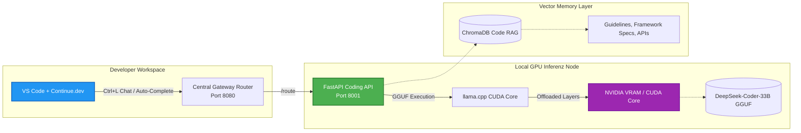

# Offline Coding Agent: GPU-Accelerated Local Code Intelligence & RAG System

This repository module showcases the architecture and local deployment configuration for the **Wasteland Offline Coding Agent**, our self-hosted, GPU-accelerated code intelligence assistant. 

Operating entirely offline, the system integrates deep-learning code generation models with ChromaDB vector search and native IDE environments to deliver developer support without data leaving our localized network.

---

## 1. Architectural System Overview

The Coding Agent is optimized to run locally on consumer-grade workstation GPUs (e.g., RTX 2070 Super / RTX 4090 series). It acts as a localized OpenAI-compatible API gateway, serving IDE autocomplete and chat requests.



---

## 2. Core Functional Pillars

### 2.1 Quantized Local LLM Server (`llama.cpp`)
To eliminate the recurring cost of external SaaS code models and protect corporate source code privacy, the coding agent runs entirely offline:
* **Quantized Model**: Executes the high-performance `deepseek-coder-33b-instruct.Q4_K_M.gguf` and `deepseek-coder-6.7b-instruct.Q4_K_M.gguf` models.
* **GPU CUDA Acceleration**: Containerized using `nvidia/cuda` base images. Compiles the `llama-cpp-python` engine with CUDA BLAS support (`DLLAMA_CUBLAS=on`) to offload layers directly into GPU VRAM (RTX 2070 Super configured to offload 43 layers, utilizing an 8192 token context window).

### 2.2 RAG-Enhanced Code Contextualization
To prevent standard coding models from generating outdated suggestions, the assistant uses Retrieval-Augmented Generation (RAG):
* **Local Ingestion**: Document spec directories, clean-code guidelines, and internal API contracts are vectorized into ChromaDB.
* **Semantic Retrieval**: Queries retrieve relevant specification blocks prior to model prompting, grounding code outputs in company-specific frameworks.

### 2.3 Integrated Developer Environment (IDE) Bridge
The system provides a drop-in API replacement for commercial coding assistants:
* **Continue.dev Integration**: Configured via local VS Code configuration files (`continue-config.json`). Features tab autocomplete, code explanation, inline debugging, and unit-test generators routing directly to our local Docker orchestrator.
* **OpenAI API Compatibility**: Exposes standard `/v1/completions` endpoints, allowing seamless integration with alternative CLI editors or automation scripts.

---

## 3. Configuration Blueprints

### 3.1 Docker Compose Deployment (Sanitized)
The following snippet represents the container specification enabling GPU pass-through and GGUF model volume mapping:

```yaml
# docker-compose.yml (Sanitized GPU Inferenz Config)

version: '3.8'

services:
  wasteland-coding:
    build:
      context: ./agents/coding
    container_name: wasteland-coding
    deploy:
      resources:
        reservations:
          devices:
            - driver: nvidia
              count: all
              capabilities: [gpu]
    networks:
      - internal_llm_net
    environment:
      - CUDA_VISIBLE_DEVICES=0
      - MODEL_PATH=/models/deepseek-coder-33b-instruct.Q4_K_M.gguf
    restart: unless-stopped
    volumes:
      - /host/models:/models:ro  # Read-only model mount
    healthcheck:
      test: ["CMD", "curl", "-f", "http://localhost:8001/health"]
      interval: 60s
      timeout: 30s
      retries: 3
```

### 3.2 VS Code Continue.dev Configuration Template
The IDE configuration routes all code intelligence inquiries to the offline gateway:

```json
{
  "models": [
    {
      "title": "Wasteland Coding Agent",
      "provider": "openai",
      "model": "deepseek-coder-33b-instruct",
      "apiBase": "http://localhost:8080",
      "apiKey": "not-needed",
      "contextLength": 8192,
      "completionOptions": {
        "temperature": 0.2,
        "maxTokens": 2048
      }
    }
  ],
  "tabAutocompleteModel": {
    "title": "Wasteland Autocomplete",
    "provider": "openai",
    "model": "deepseek-coder-6.7b-instruct",
    "apiBase": "http://localhost:8080",
    "contextLength": 4096
  }
}
```

---

## 4. Tech Stack

* **Inference Core**: `llama-cpp-python`, `nvidia/cuda:12.1.1-runtime-ubuntu22.04`
* **Local Models**: `DeepSeek-Coder-33B-Instruct` (Q4_K_M GGUF)
* **Vector DB**: ChromaDB
* **API Gateway**: FastAPI, Uvicorn, Requests
* **IDE Client**: VS Code (Continue Extension)

---

## 5. Development Roadmap

* [x] **Local CUDA pass-through**: Successful deployment on RTX workstation GPUs.
* [x] **IDE Autocomplete Integration**: Tab completions routed through local models.
* [ ] **Self-Hosting Model Registry (Q2 2026)**: Integrate local HuggingFace cache nodes to automate quantized model updates.
* [ ] **Automated Dynamic Prompt Tuning (Q3 2026)**: Tune agents' context dynamically based on historical execution performance.

---

## 6. Redaction Notice

All local directories, actual developer credentials, absolute system volumes, and network host names have been replaced with generalized environment variable templates.
