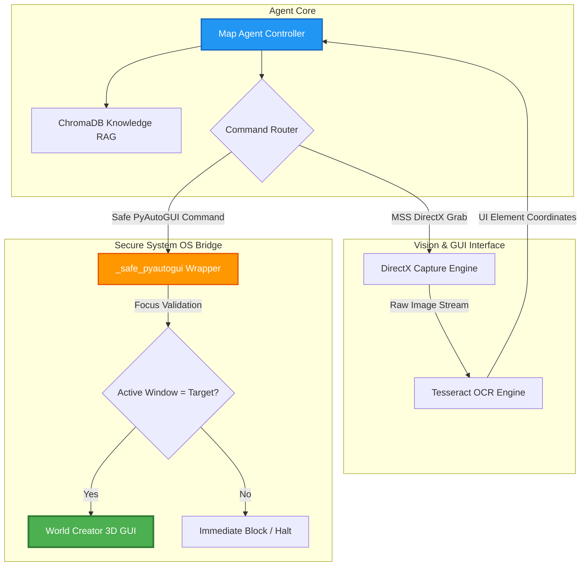

# Map-Erstellungs- & Validierungs-Agent: Visuelle RAG-Softwareautomatisierung

Dieses Repository-Modul beschreibt die Systemarchitektur des **Wasteland Map-Erstellungs-Agents**, eines hochentwickelten Automatisierungssystems für die Generierung von Landschaften und die Validierung von Levels für Game-Engines (Unreal Engine 5).

Durch die Kombination von DirectX-kompatibler Bildverarbeitung (Computer Vision), Texterkennung (OCR) und semantischer RAG-Intelligenz steuert, erstellt und validiert der Agent räumliche Daten aus proprietärer Desktop-Software vollautomatisch und ohne menschliche Interaktion.

---

## 1. Architektonische Systemübersicht

Da High-End-Terraining-Software (wie World Creator) in der Regel über keine offenen Programmierschnittstellen (APIs) verfügt, nutzt der Map Agent eine **bildverarbeitungsgestützte Hybrid-Interaktions-Engine**. Diese analysiert die grafische Benutzeroberfläche in Echtzeit und verknüpft visuelle Koordinaten mit gelernten Abläufen aus unserem RAG-Wissensspeicher.



---

## 2. Zentrale Funktionssäulen

### 2.1 Die DirectX Computer-Vision-Suite
Standardmäßige Python-Bibliotheken zur Erstellung von Screenshots erzeugen oft schwarze Bilder, wenn sie auf hardwarebeschleunigte DirectX- oder OpenGL-Schnittstellen zugreifen.
* **MSS-Bibliothek**: Der Agent nutzt MSS (Multi-Screen Shot), um Framebuffer direkt aus dem GPU-Speicher in 50ms-Intervallen zu erfassen.
* **Tesseract-OCR-Integration**: Analysiert die erfassten Frames lokal und erstellt eine räumliche Koordinaten-Datenbank aller sichtbaren Menütexte, Buttons und Parameter.
* **UI-Learning-System**: Erfasst vollautomatisch UI-Screenshots im Hintergrund, extrahiert Schaltflächen (415+ UI-Elemente indiziert) und lernt Menühierarchien selbstständig.

### 2.2 Der Zero-Loss-Sicherheits-Wrapper (`_safe_pyautogui`)
Blinde GUI-Steuerung über feste Pixel-Koordinaten birgt das Risiko, versehentlich falsche Steuerungselemente oder andere Fenster zu treffen.
* **Fokusschutz**: Der Wrapper `_safe_pyautogui` fängt alle hardwarenahen Tastatur- und Mausbefehle ab.
* **Statusprüfung**: Vor jeder Interaktion validiert das System, ob die Ziel-Software (World Creator) das aktive, im Vordergrund befindliche Fenster im Betriebssystem hält. Geht der Fokus verloren, stoppt die Ausführung sofort.

### 2.3 RAG-gestützte, dynamische Navigation
Anstatt starrer, linearer Klick-Skripte navigiert der Agent dynamisch basierend auf Kontext:
* **ChromaDB-Wissen**: Offizielle Handbücher, Shortcut-Verzeichnisse und gelernte UI-Datenbanken sind in der Vektordatenbank indiziert.
* **Dynamische Planung**: Um beispielsweise "Perlin Noise" hinzuzufügen, fragt der Agent ChromaDB nach den benötigten Shortcuts und Menüpfaden ab, lokalisiert die Tasten per OCR und führt die Schritte dynamisch aus.

### 2.4 Epic Games FAB Marketplace-Compliance-Prüfer
Überprüft exportierte Assets gegen strenge Marktplatz-Richtlinien von Epic Games:
* **Rule Engine**: Prüft Höhendaten und Terrains auf korrekte Abmessungen (z. B. Power-of-Two-Richtlinien von Unreal Engine).
* **Asset-Autofixer**: Generiert vollautomatisch Level-of-Detail-Meshes (LODs), repariert fehlende Kollisionsdaten, korrigiert Texturreferenzen und normalisiert Dateinamen.

---

## 3. Abstrahierte Systemimplementierung

Die folgende Python-Struktur zeigt die Logik unseres DirectX-Captures und des sicheren Windows-Fokus-Wrappers:

```python
# Map Creation Agent - Vision and OS Control Logic (Sanitisiertes Modell)

import mss
import pyautogui

class SecureOSWrapper:
    def __init__(self, target_window_title: str):
        self.target_title = target_window_title

    def _is_target_active(self) -> bool:
        """Überprüft, ob das Ziel-3D-Programm das aktive Betriebssystem-Fenster ist."""
        # Sanitisiertes Windows-API-Binding: GetActiveWindow() Titel auslesen
        active_title = self._get_active_window_title()
        return self.target_title in active_title

    def safe_click(self, x: int, y: int):
        """Führt Mausklicks nur bei verifiziertem Anwendungsfokus aus."""
        if not self._is_target_active():
            raise SecurityBoundaryException("Sicherheitsverletzung: Anwendungsfokus verloren!")
        pyautogui.moveTo(x, y, duration=0.2)
        pyautogui.click()

    def _get_active_window_title(self) -> str:
        # Praktische Umsetzung: Wrappt win32gui.GetWindowText(win32gui.GetForegroundWindow())
        return "World Creator - Project View"

class DirectXVisionEngine:
    def capture_viewport(self, monitor_idx: int = 1) -> bytes:
        """Erfasst hardwarebeschleunigte DirectX-Viewport-Frames mittels MSS."""
        with mss.mss() as sct:
            # Viewport-Grenzen bestimmen
            monitor = sct.monitors[monitor_idx]
            screenshot = sct.grab(monitor)
            # Liefert rohe Bilddaten für Tesseract-OCR-Routinen
            return screenshot.rgb
```

---

## 4. Tech Stack

* **Betriebssystem**: Windows (Host Server)
* **Automatisierungs-Schnittstellen**: PyAutoGUI (mit win32gui Fokus-Wächter)
* **Bildverarbeitung**: MSS (DirectX-kompatibel), PIL (Pillow), Tesseract-OCR
* **Vektor-DB**: ChromaDB (Collection: `world_creator_knowledge`)
* **Sprache**: Python 3.11, Docker

---

## 5. Roadmap

* [x] **DirectX Frame Capture**: MSS-Integration liest hardwarebeschleunigte Grafikpuffer fehlerfrei aus.
* [x] **OCR Button-Klick**: Menü-Interaktionen über dynamische Texterkennung erfolgreich getestet (96%+ Konfidenz).
* [ ] **Vollständiger RAG-End-to-End-Loop (Q2 2026)**: Vollautomatisierte Generierung von Terrains von der Textbeschreibung bis zum fertigen RAW-Höhenkartenexport.
* [ ] **Unreal Engine 5 CLI-Brücke (Q3 2026)**: Integration von Python-Scripting in UE5 zur direkten, skriptgesteuerten Platzierung generierter Höhendaten im Levelraster.

---

## 6. Redaction Notice

Sämtliche lokalen Tesseract-Installationspfade, Windows-DLL-Pointer, rohe Trainingsdaten und proprietäre 3D-Modelle wurden aus dieser Dokumentation entfernt.
