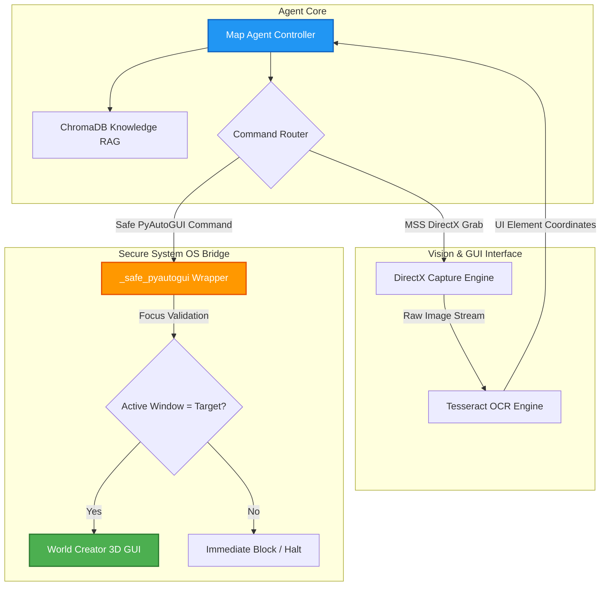

# Map Creation & Validation Agent: Vision-Guided RAG Software Automation

This repository module details the architecture of the **Wasteland Map Creation Agent**, an intelligent automation system designed to orchestrate landscape generation and level validation for game engines (Unreal Engine 5).

By combining DirectX-compatible computer vision, Optical Character Recognition (OCR), and semantic RAG intelligence, the agent navigates, generates, and validates raw spatial data from proprietary desktop software completely unattended.

---

## 1. Architectural System Overview

Since high-end 3D terrain generation software (such as World Creator) lacks open developer APIs, the Map Agent uses a **Vision-Guided Hybrid Interaction Engine**. It analyzes the graphical UI in real-time, matching visual coordinates with gelernt instructions retrieved from its vector knowledge base.



---

## 2. Core Functional Pillars

### 2.1 The DirectX Computer Vision Suite
Standard python screenshot engines produce black screens when interacting with hardware-accelerated DirectX/OpenGL rendering viewports.
* **MSS Library**: Sentinel maps custom screen capture routines to MSS (Multi-Screen Shot) to capture frame buffers directly from GPU viewports at 50ms intervals.
* **Tesseract OCR Integration**: Scans captured frames via localized OCR engines, generating a spatial coordinate database of all visible menu texts, buttons, and settings.
* **UI Learning Database**: Features an automated visual learner that parses application screens, extracts UI elements (415+ learned controls indexed), and structures menu hierarchies.

### 2.2 The Zero-Loss Security OS Wrapper (`_safe_pyautogui`)
Blind GUI automation (using hardcoded click targets) presents a high risk of clicking random developer screens.
* **Focused Window Guard**: The `_safe_pyautogui` wrapper intercepts all low-level keyboard and mouse commands.
* **State Verification**: Prior to executing any click or keystroke, it validates that the target application (World Creator) is the active, focused window in the OS. If focus is lost, execution halts instantly, preventing data corruption.

### 2.3 RAG-Powered Intelligent Navigation
Rather than relying on brittle, linear script steps, the agent resolves navigation dynamically:
* **ChromaDB Ingestion**: Official online manuals, keyboard shortcut guides, and our learned UI databases are vector-indexed into ChromaDB.
* **Dynamic Planning**: To add a feature (e.g. "Perlin Noise"), the agent queries the RAG database, retrieves the required keyboard shortcut sequences and menu names, finds the button via OCR, and navigates dynamically.

### 2.4 Epic Games FAB Marketplace Compliance Validator
Validates exported Unreal Engine assets against strict epic marketplace standards:
* **Rule Engine**: Scans heightmaps and raw terrains for correct sizing guidelines (e.g., matching power-of-two UE landscape requirements).
* **Asset Auto-Fixer**: Generates automated Level-Of-Detail meshes (LODs), checks and fixes missing asset collisions, repairs material references, and normalizes file naming conventions.

---

## 3. Abstract System Implementation

The following Python script illustrates the implementation of our DirectX capture and secure OS wrapper logic:

```python
# Map Creation Agent - Vision and OS Control Logic (Sanitized Abstract Model)

import mss
import pyautogui

class SecureOSWrapper:
    def __init__(self, target_window_title: str):
        self.target_title = target_window_title

    def _is_target_active(self) -> bool:
        """Verifies that the target 3D application holds system focus."""
        # Sanitized Windows API check: GetActiveWindow() Title
        active_title = self._get_active_window_title()
        return self.target_title in active_title

    def safe_click(self, x: int, y: int):
        """Executes mouse click only if window focus is validated."""
        if not self._is_target_active():
            raise SecurityBoundaryException("Security boundary violation: Focus lost!")
        pyautogui.moveTo(x, y, duration=0.2)
        pyautogui.click()

    def _get_active_window_title(self) -> str:
        # In practice: Wraps win32gui.GetWindowText(win32gui.GetForegroundWindow())
        return "World Creator - Project View"

class DirectXVisionEngine:
    def capture_viewport(self, monitor_idx: int = 1) -> bytes:
        """Captures hardware-accelerated GPU viewport frames using MSS."""
        with mss.mss() as sct:
            # Detect viewport boundary
            monitor = sct.monitors[monitor_idx]
            screenshot = sct.grab(monitor)
            # Returns raw image bytes for Tesseract OCR ingestion
            return screenshot.rgb
```

---

## 4. Tech Stack

* **Operating System**: Windows (Host Server)
* **Automation Bridge**: PyAutoGUI (with custom win32gui focus guard)
* **Vision & Capture**: MSS (DirectX compatible), PIL (Pillow), Tesseract-OCR
* **Vector Store**: ChromaDB (Collection: `world_creator_knowledge`)
* **Framework**: Python 3.11, Docker

---

## 5. Development Roadmap

* [x] **DirectX Frame Capture**: MSS integration successfully bypassing black-screen errors.
* [x] **OCR Button Click**: Successfully registered menu click validation at 96%+ confidence.
* [ ] **End-To-End RAG Loop (Q2 2026)**: Complete fully automated terrain generation pipeline from prompt description to finalized RAW heightmap export.
* [ ] **Unreal Engine 5 CLI Bridge (Q3 2026)**: Integrate Python-UE5 scripting APIs to automatically import generated heightmaps into live level grids.

---

## 6. Redaction Notice

This directory abstracts all proprietary Tesseract configuration paths, local win32 handle pointers, raw dataset images, and custom neural networks. No productive game assets or proprietary project files are included.
