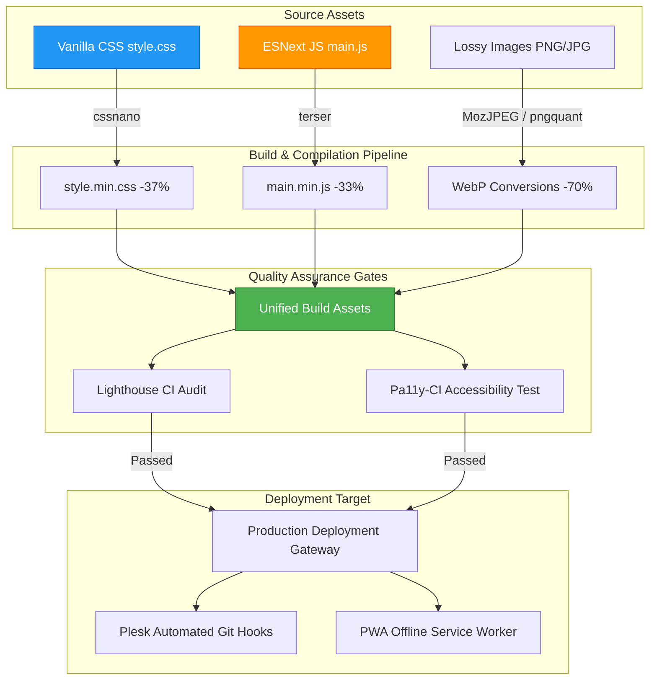

# Business Suite Frontend: High-Performance Static Web & Core SEO Engineering

Dieses Repository-Modul beschreibt die Systemarchitektur und die Build-Automatisierung des **Wasteland Business Suite Frontends** (unserer offiziellen Webseite und dem SaaS-Einstiegsportal).

Nach unserer **Vanilla-First-Philosophie** verzichtet die Seite auf schwere clientseitige Frameworks und erzielt stattdessen durch optimierten, nativen Code, automatisierte Build-Pipelines und PWA-Offline-Caching extrem schnelle Ladezeiten und eine lückenlose Barrierefreiheit.

---

## 1. Architektonische Systemübersicht

Die Frontend-Architektur legt den Fokus auf Ladezeit-Optimierung, strukturierte SEO-Indexierung und progressive Ausfallsicherheit. Ein lokaler Node.js-Build-Prozess minifiziert Assets, komprimiert Bilddaten und auditiert die Barrierefreiheit vor jedem Release.



---

## 2. Zentrale Funktionssäulen

### 2.1 Die Build-Optimierungs-Pipeline
Um die anfängliche Ladezeit (First Contentful Paint) zu minimieren und mobile Endgeräte zu entlasten, setzt das Portal auf performante, native Webtechnologien:
* **CSS-Minifizierung**: Unsere Stylesheets werden über `cssnano` optimiert, wodurch die Dateigröße um **37%** (von 40KB auf 25KB) sinkt.
* **JavaScript-Minifizierung**: Die Logik der Webseite wird mittels `terser` komprimiert, indem ungenutzter Code, Log-Ausgaben und Kommentare entfernt werden, was die Dateigröße um **33%** (von 15KB auf 10KB) verringert.
* **Automatisierte Bildkomprimierung**: Konvertiert PNGs und JPGs über `pngquant` und `MozJPEG` in das moderne WebP-Format. Dies führt zu einer Einsparung des gesamten Medien-Footprints um **70%**.

### 2.2 Barrierefreiheit & Qualitäts-Audits (Pa11y & Lighthouse)
Barrierefreiheit (Accessibility) wird bei uns programmgesteuert in der Build-Pipeline sichergestellt:
* **Pa11y CI-Integration**: Jede Unterseite wird über `pa11y-ci` gegen die Richtlinien der WCAG 2.1 AA geprüft. Kontrastfehler, fehlende ARIA-Attribute oder unzureichende Labels führen zu einem sofortigen Abbruch des Build-Prozesses.
* **Lighthouse Performance Budgets**: Unsere Build-Scripts führen Headless-Chrome-Audits aus und erzwingen einen Lighthouse-Score von mindestens **95+** auf Mobil- und Desktop-Indizes.

### 2.3 Strukturiertes SEO & Semantische Indexierung
Zur Erzielung erstklassiger Platzierungen in Suchmaschinen setzen wir auf semantische Strukturierung:
* **Überschriften-Hierarchie**: Strenges, valides HTML-Outline (einziges `<h1>` pro Seite, logisch aufeinanderfolgende `<h2>` bis `<h5>` Überschriften).
* **JSON-LD Schema-Einspeisung**: Einpflegen standardisierter JSON-LD-Strukturschemata für unsere SaaS-Dienste, IT-Sicherheitsprodukte und Unternehmensdaten zur Generierung von Rich Snippets in Suchergebnissen.
* **Metadaten-Ausrichtung**: Präzise Abstimmung von Page-Titles, Open Graph (OG) Social-Sharing-Headern und dynamischen XML-Sitemaps für Suchmaschinen-Crawler.

### 2.4 Progressive Web App (PWA) & Offline-Verhalten
Enthält einen integrierten, nativen Service Worker (`sw.js`):
* **Ressourcen-Caching**: Nutzt das "Cache First, Network Fallback"-Prinzip für statische Assets (Fonts, Icons, CSS, JS) für nahezu sofortige Ladezeiten bei wiederkehrenden Besuchen.
* **Offline-Ausweichseite**: Zeigt bei Verbindungsverlust des Nutzers eine integrierte Offline-Wartungsseite (`maintenance.html`) an, um auch unter instabilen Netzwerkbedingungen ein sauberes Benutzererlebnis zu gewährleisten.

---

## 3. Optimierungs-Konfigurationen

### 3.1 Node.js Build-Spezifikationen (`package.json` Ausschnitt)
Die Build-Konfiguration definiert die Skripte zur Asset-Minifizierung und Qualitätsprüfung:

```json
{
  "name": "wasteland-business-suite",
  "version": "1.2.0",
  "scripts": {
    "build:css": "postcss css/style.css -use cssnano -o css/style.min.css",
    "build:js": "terser js/main.js -c -m -o js/main.min.js",
    "build:images": "node scripts/optimize-images.js",
    "build": "npm run build:css && npm run build:js && npm run build:images",
    "watch": "chokidar \"css/*.css\" \"js/*.js\" -c \"npm run build\"",
    "test:a11y": "pa11y-ci --config .pa11yci.json",
    "lighthouse": "lighthouse http://localhost:8000 --chrome-flags=\"--headless\""
  },
  "devDependencies": {
    "cssnano": "^6.0.3",
    "terser": "^5.27.0",
    "pa11y-ci": "^3.0.1",
    "postcss-cli": "^11.0.0",
    "chokidar-cli": "^3.0.0"
  }
}
```

### 3.2 HTML Head Semantische Schemata & PWA
Das Basistemplate bindet JSON-LD-Daten und Service-Worker sauber ein:

```html
<!DOCTYPE html>
<html lang="de">
<head>
  <meta charset="UTF-8">
  <meta name="viewport" content="width=device-width, initial-scale=1.0">
  <title>Wasteland Interactive | AI Engineering & Operations</title>
  <link rel="stylesheet" href="css/style.min.css">
  
  <!-- Semantische JSON-LD-Datenstruktur (Sanitisiert) -->
  <script type="application/ld+json">
  {
    "@context": "https://schema.org",
    "@type": "Organization",
    "name": "Wasteland Interactive",
    "url": "https://wasteland-interactive.de",
    "logo": "https://wasteland-interactive.de/assets/logo.png",
    "sameAs": [
      "https://github.com/wasteland-interactive"
    ]
  }
  </script>
</head>
<body>
  
  <!-- PWA Service Worker Registrierung -->
  <script>
    if ('serviceWorker' in navigator) {
      window.addEventListener('load', () => {
        navigator.serviceWorker.register('/sw.js')
          .then(reg => console.log('PWA Service Worker erfolgreich registriert.'))
          .catch(err => console.error('PWA Service Worker Registrierung fehlgeschlagen:', err));
      });
    }
  </script>
</body>
</html>
```

---

## 4. Tech Stack

* **Basistechnologien**: HTML5, Vanilla CSS3, ESNext JavaScript
* **Build-Compiler**: `PostCSS`, `cssnano`, `terser`, `imagemin`
* **Qualitätssicherung**: `pa11y-ci` (WCAG 2.1 AA Audits), `lighthouse` (Google Lighthouse CLI)
* **PWA-Features**: Native Service Workers, Cache API, Web Manifest v3

---

## 5. Roadmap

* [x] **Minifizierungs-Pipelines**: CSS- und JS-Build-Skripte über `cssnano` und `terser` vollständig integriert.
* [x] **PWA Service Worker**: Cache-First-Prinzip für statische Inhalte einsatzbereit.
* [ ] **GitHub Actions CI/CD Pipeline (Q2 2026)**: Integration automatisierter Barrierefreiheitsprüfungen bei jedem Pull-Request, um unzugänglichen Code vor dem Merge abzufangen.
* [ ] **Globale CDN-Verteilung (Q3 2026)**: Ausspielung aller statischen Assets über Edge-Worker zur Ladezeit-Optimierung in internationalen Regionen.

---

## 6. Redaction Notice

Absolute FTP-Verzeichnispfade auf Webservern, produktive SSH-Zugangsdaten, interne SEO-Analyseschlüssel und private Webhook-Endpunkte wurden aus diesem Showcase-Verzeichnis entfernt.
