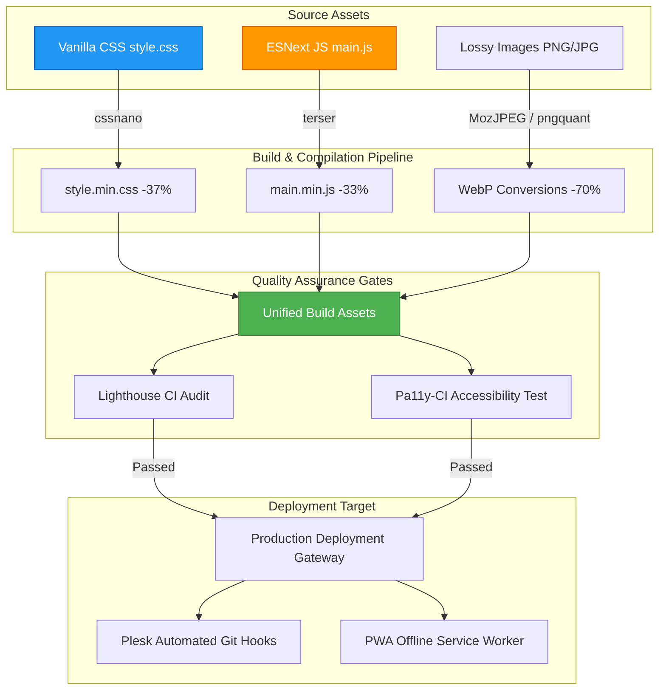

# Business Suite Frontend: High-Performance Static Web & Core SEO Engineering

This repository module showcases the architecture and build automation configurations for the **Wasteland Business Suite Frontend** (our modern web presence and SaaS entry portal).

Designed with a **Vanilla-First philosophy**, the frontend achieves ultra-fast load times, seamless accessibility compliance, and progressive offline capability through clean vanilla coding structures and automated build pipelines.

---

## 1. Architectural System Overview

The frontend architecture prioritizes performance optimization, structured SEO indexing, and progressive enhancement. It utilizes local Node.js compilation scripts to minify assets, compress media, and audit accessibility before deployment.



---

## 2. Core Functional Pillars

### 2.1 The Build Optimization Pipeline
Rather than relying on heavy client-side rendering frameworks (like React or Angular) which increase initial page weight, the portal is built using performant native HTML5, ESNext JavaScript, and vanilla CSS:
* **Style Minification**: Standard styles undergo automated minification using `cssnano`, reducing style footprints by **37%** (from 40KB down to 25KB).
* **JavaScript Minification**: Code logic is optimized via `terser`, stripping dead code, console logs, and comments to compress file sizes by **33%** (from 15KB down to 10KB).
* **Automated Image Conversions**: Converts legacy PNG/JPG formats to modern WebP assets using `pngquant` and `MozJPEG`, resulting in a **70%** reduction in total media size.

### 2.2 Accessibility & Quality Auditing (Pa11y & Lighthouse)
High accessibility standards are enforced programmatically in our continuous integration pipeline:
* **Pa11y CI Integration**: Every page is tested against strict Web Content Accessibility Guidelines (WCAG 2.1 AA) using `pa11y-ci`. Any contrast issues, missing ARIA tags, or poor label alignments trigger build-time failures.
* **Lighthouse Audits**: System build scripts run headless chrome Lighthouse audits, enforcing a minimum performance budget of **95+** on mobile and desktop indices.

### 2.3 Structured SEO & Semantic Indexing
To maximize discoverability in modern search engines, we implement semantic search optimization:
* **Heading Hierarchy**: Enforces a strict semantic heading outline (a single `<h1>` per page, sequential `<h2>` to `<h5>` usage).
* **JSON-LD Schema Injection**: Inject structured JSON-LD schemas representing our SaaS pricing, IT security products, and organization data, enabling rich search snippet integrations.
* **Metadata Alignment**: Descriptively matches titles, Open Graph (OG) social share headers, and XML sitemaps to optimize crawlers' workflows.

### 2.4 Progressive Web App (PWA) Capabilities
Features a resilient native service worker (`sw.js`):
* **Resource Caching**: Implements a "Cache First, Network Fallback" caching pattern for static assets (fonts, icons, compiled CSS/JS), enabling instant loading upon return visits.
* **Offline Fallback**: Displays a unified offline maintenance page (`maintenance.html`) if users lose network access, ensuring a clean user experience under unstable mobile connections.

---

## 3. Optimization Pipeline Configurations

### 3.1 Node.js Build Specification (`package.json` Snippet)
The build configuration maps the optimization scripts and quality audit commands:

```json
{
  "name": "wasteland-business-suite",
  "version": "1.2.0",
  "scripts": {
    "build:css": "postcss css/style.css -use cssnano -o css/style.min.css",
    "build:js": "terser js/main.js -c -m -o js/main.min.js",
    "build:images": "node scripts/optimize-images.js",
    "build": "npm run build:css && npm run build:js && npm run build:images",
    "watch": "chokidar \"css/*.css\" \"js/*.js\" -c \"npm run build\"",
    "test:a11y": "pa11y-ci --config .pa11yci.json",
    "lighthouse": "lighthouse http://localhost:8000 --chrome-flags=\"--headless\""
  },
  "devDependencies": {
    "cssnano": "^6.0.3",
    "terser": "^5.27.0",
    "pa11y-ci": "^3.0.1",
    "postcss-cli": "^11.0.0",
    "chokidar-cli": "^3.0.0"
  }
}
```

### 3.2 HTML Head Semantic Schema Implementation
The base template injects JSON-LD schemas and PWA service workers cleanly:

```html
<!DOCTYPE html>
<html lang="en">
<head>
  <meta charset="UTF-8">
  <meta name="viewport" content="width=device-width, initial-scale=1.0">
  <title>Wasteland Interactive | AI Engineering & Operations</title>
  <link rel="stylesheet" href="css/style.min.css">
  
  <!-- Semantic JSON-LD Schema (Sanitized Organzation Model) -->
  <script type="application/ld+json">
  {
    "@context": "https://schema.org",
    "@type": "Organization",
    "name": "Wasteland Interactive",
    "url": "https://wasteland-interactive.de",
    "logo": "https://wasteland-interactive.de/assets/logo.png",
    "sameAs": [
      "https://github.com/wasteland-interactive"
    ]
  }
  </script>
</head>
<body>
  
  <!-- Service Worker Register Script -->
  <script>
    if ('serviceWorker' in navigator) {
      window.addEventListener('load', () => {
        navigator.serviceWorker.register('/sw.js')
          .then(reg => console.log('PWA Service Worker registered successfully.'))
          .catch(err => console.error('PWA Service Worker registration failed:', err));
      });
    }
  </script>
</body>
</html>
```

---

## 4. Tech Stack

* **Core Styling & Logic**: HTML5, Vanilla CSS3, ESNext JavaScript
* **Build Compilers**: `PostCSS`, `cssnano`, `terser`, `imagemin`
* **Quality Assurance**: `pa11y-ci` (WCAG 2.1 AA checking), `lighthouse` (Google Lighthouse CLI)
* **PWA Features**: Native Service Workers, Cache API, Web Manifest v3

---

## 5. Development Roadmap

* [x] **Minification Pipelines**: `cssnano` and `terser` integrations completed.
* [x] **PWA Service Worker**: Cache-first asset caching operational.
* [ ] **GitHub Actions CI/CD Pipeline (Q2 2026)**: Integrate the Pa11y accessibility and Lighthouse budget tests directly into branch merge blocks to auto-fail broken commits.
* [ ] **Edge CDN Distribution (Q3 2026)**: Deploy assets globally across Cloudflare edge workers with localized static cache routing.

---

## 6. Redaction Notice

Absolute deployment FTP paths, production server shell environments, internal SEO analytics keys, and private webhook endpoints are stripped from this repository.
