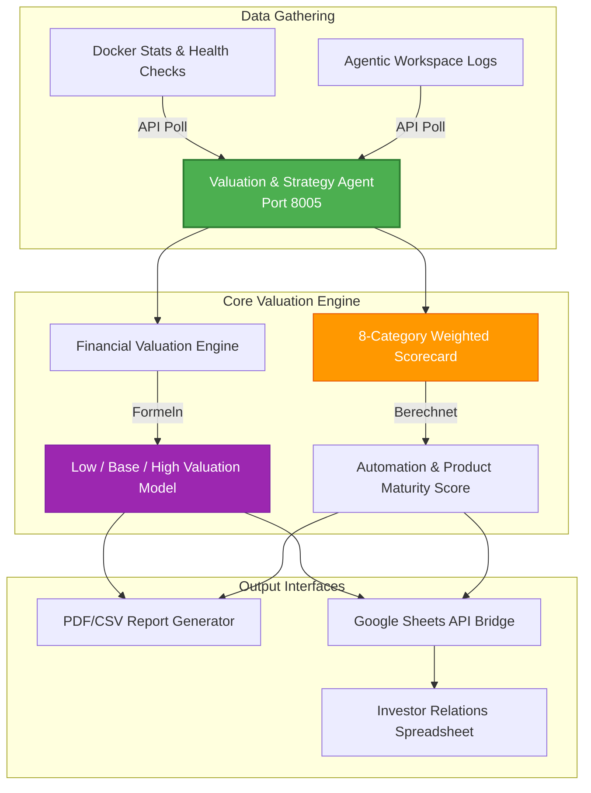

# Valuation & Strategy Agent: Automatisierte Finanz-Scorings & CFO-Bewertungs-Engine

Dieses Repository-Modul beschreibt die Systemarchitektur des **Wasteland Valuation & Strategy Agents (VSA)**, unserer automatisierten CFO-Analyselösung.

VSA fungiert als Business-Intelligence-Scanner in Echtzeit. Die Lösung führt quantitative Reifegrad-Prüfungen durch, simuliert Unternehmensbewertungen, überwacht Server-Betriebskosten und erstellt berichte für Investoren vollautomatisch.

---

## 1. Architektonische Systemübersicht

Der VSA arbeitet als analytische Business-Intelligence-Schicht. Das System liest Serverzustände aus Docker-Compose-Dateien aus, aggregiert Betriebsmetriken, führt Finanzberechnungen durch und sendet strukturierte Daten an externe Investorenportale.



---

## 2. Zentrale Funktionssäulen

### 2.1 Die gewichtete 8-Kategorien-Scorecard
Der VSA bewertet den Reifegrad des gesamten agentischen Ökosystems von Wasteland Interactive anhand von 8 zentralen Säulen mit spezifischen Gewichtungen:
* **Produktreife (15%)**: Bewertet die SaaS-Readiness der entwickelten Module.
* **Technische Skalierung (15%)**: Analysiert Container-Stabilität und Latenzen.
* **Automatisierungsgrad (15%)**: Erfasst den Prozentsatz der Workflows, die ohne manuelle Entwicklereingriffe ablaufen.
* **Monetarisierung (15%)**: Prüft Checkout-Integrationen und Abrechnungsschnittstellen.
* **Markt & Timing (10%)**: Vergleicht Fähigkeiten mit Branchen-Wettbewerbern.
* **Vertriebs- & Akquisekanäle (10%)**: Überwacht die Conversion-Raten der Marketing-Funnel.
* **Gründer-Risiko (10%)**: Bewertet die operative Autonomie der Systeme von den Entwicklern.
* **Investoren-Bereitschaft (10%)**: Prüft die Einhaltung regulatorischer Compliance.

### 2.2 Die Finanz-Bewertungs-Engine
Die Systemwerte werden über ein hybrides Bewertungsmodell in Finanzdaten übersetzt:
* **Substanzwert (Asset-Based)**: Summe der geschätzten Werte aller deployed System-Komponenten.
* **Umsatz-Multiple**: Berechnet den Unternehmenswert auf Basis des Monthly Recurring Revenues (MRR) multipliziert mit Branchenkoeffizienten.
* **Automatisierungs-Bonus**: Addiert eine Prämie, berechnet als: `automation_score * $50.000` (bewertet die Einsparung durch selbstheilende Workflows).
* **Marktanpassungen**: Nutzt dynamische Faktoren zur Darstellung konservativer (Low), wahrscheinlicher (Base) und optimistischer (High) Marktszenarien.

### 2.3 System-Infrastruktur-Telemetry
Der VSA arbeitet nicht auf statischen Daten, sondern liest operative Systemzustände aus:
* **Docker Statistics**: Analysiert Speicherauslastung und CPU-Lastprofile der aktiven Container.
* **Agenten-Diagnose**: Führt regelmäßige Health-Check-Abfragen zur Messung der Antwortlatenz aus.

### 2.4 Google Sheets API & Exporte
Sichere Reporting-Pipeline:
* **Dynamische Tabellen**: Kommuniziert über die Google Sheets API zur Pflege von Investoren-Dashboards.
* **Multi-Format-Berichte**: Exportiert PDF- und CSV-Dateien für monatliche Finanzreports.

---

## 3. Abstrahierte Systemimplementierung

Die folgende Python-Struktur zeigt die Implementierung von VSAs Reifegrad-Prüfung und Bewertungslogik:

```python
# Valuation & Strategy Agent - Valuation & Scorecard Logic (Sanitisiertes Modell)

class CFOValuationEngine:
    def __init__(self, monthly_revenue: float, industry_multiple: float):
        self.monthly_revenue = monthly_revenue
        self.multiple = industry_multiple
        # Gewichtung der Scorecard-Kategorien
        self.weights = {
            "product_maturity": 0.15,
            "technical_scaling": 0.15,
            "automation_index": 0.15,
            "monetization": 0.15,
            "market_timing": 0.10,
            "founder_risk": 0.10,
            "investor_readiness": 0.10,
            "sales_channels": 0.10
        }

    def calculate_automation_score(self, operational_logs: list) -> float:
        """Ermittelt den Automatisierungsgrad basierend auf Freigabe-Interaktionen."""
        total_runs = len(operational_logs)
        if total_runs == 0:
            return 0.0
        automated_runs = sum(1 for log in operational_logs if log.get("human_approval") is False)
        return float(automated_runs) / total_runs

    def compute_ecosystem_valuation(self, scores: dict, agent_asset_values: dict) -> dict:
        """Berechnet die finanzielle Bewertung basierend auf Substanzwert und Umsatzdaten."""
        # Gewichteter Reifegrad-Score
        scorecard_score = sum(scores[cat] * self.weights[cat] for cat in self.weights)
        
        # 1. Substanzwert (Summe der technischen Assets)
        asset_value = sum(agent_asset_values.values())
        
        # 2. Umsatzwert (MRR * 12 * Multiple)
        annualized_revenue = self.monthly_revenue * 12
        revenue_value = annualized_revenue * self.multiple
        
        # 3. Automatisierungs-Effizienzbonus
        automation_score = scores.get("automation_index", 0.0)
        automation_bonus = automation_score * 50000.0
        
        # Basis-Wert
        base_value = asset_value + revenue_value + automation_bonus
        
        return {
            "scorecard_weighted_index": scorecard_score,
            "valuation_scenarios": {
                "low": base_value * 0.8,
                "base": base_value,
                "high": base_value * 1.5
            }
        }
```

---

## 4. Tech Stack

* **Sprache**: Python 3.11+
* **Datenverarbeitung**: Pandas, NumPy
* **APIs**: FastAPI, Requests
* **Google Cloud SDK**: Google Sheets API, Google Drive API

---

## 5. Roadmap

* [x] **Bewertungslogiken**: Gewichtete Scorecard und Finanzformeln erfolgreich getestet.
* [x] **Google Sheets Exporter**: Tabellenaktualisierung über Remote-Pipelines betriebsbereit.
* [ ] **Intelligente Finanz-Prognosen (Q2 2026)**: Implementierung von Monte-Carlo-Simulationen zur Berechnung zukünftiger Cashflows basierend auf operativen Serverlaufzeiten.
* [ ] **Cloud-Kosten-Audits (Q3 2026)**: Direkte Anbindung des Agents an Cloud-Billing-APIs (AWS/GCP), um Infrastruktur-Kosten-Nutzen-Analysen (ROI) vollautomatisch durchzuführen.

---

## 6. Redaction Notice

Google-Service-Account-Dateien, private Investoren-Spreadsheet-IDs, exakte Umsatzdaten und geheime Verträge wurden aus dieser Dokumentation entfernt.
