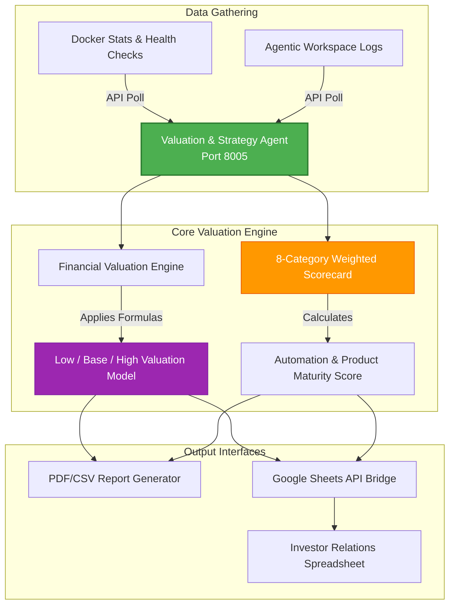

# Valuation & Strategy Agent: Automated Strategic Analytics & CFO Valuation Engine

This repository module showcases the architecture of the **Wasteland Valuation & Strategy Agent (VSA)**, our automated CFO analytics engine. 

VSA acts as a real-time corporate business-intelligence scanner, running quantitative evaluation scorecards, dynamic startup valuation simulations, system cost auditing, and investor-ready reporting metrics completely automatically.

---

## 1. Architectural System Overview

The VSA operates as an analytical business-intelligence layer. It polls infrastructure health records from Docker Compose endpoints, aggregates system metrics, calculates financial values, and pushes structured sheets to external investor portals.



---

## 2. Core Functional Pillars

### 2.1 The 8-Category Weighted Scorecard
The VSA scores the maturity of the Wasteland agentic ecosystem across 8 key operational pillars, weighting their strategic significance:
* **Product Maturity (15%)**: Measures the SaaS readiness of operational modules.
* **Technical Scaling (15%)**: Audits container health and network latency.
* **Automation Index (15%)**: Evaluates the percentage of workflows running without manual developer intervention.
* **Monetization Readiness (15%)**: Validates checkout integrations and billing webhooks.
* **Market & Timing (10%)**: Compares features against competitor benchmarks.
* **Sales & Acquisition Channels (10%)**: Monitors active marketing funnels.
* **Founder Dependency Risk (10%)**: Scores operational autonomy from human creators.
* **Investor Readiness (10%)**: Measures data clarity and compliance reports.

### 2.2 Financial Valuation Engine
The agent translates operational technical scores into financial metrics using a hybrid valuation model:
* **Asset-Based Value**: Sum of estimated valuations of all deployed agent systems.
* **Revenue-Based Value**: Computes valuation based on monthly recurring revenue (MRR) multiplied by localized industry multiples.
* **Automation Bonus**: Adds a premium calculated as: `automation_score * $50,000` (valuing the efficiency of self-healing agent processes).
* **Market Adjustments**: Applies dynamic scaling coefficients to simulate low, base, and high-market scenarios.

### 2.3 System Health Telemetry & Audits
Rather than relying on static inputs, the VSA is directly connected to the local operations network:
* **Docker Statistics**: Collects container status, memory footprint, and CPU load profiles of running agent nodes.
* **Agent Diagnostics**: Runs scheduled health-check endpoints, validating API response latency.

### 2.4 Google Sheets API & Report Exporters
Features a secure reporting pipeline:
* **Dynamic Spreadsheets**: Interacts with the Google Sheets API, maintaining up-to-date investor dashboards.
* **Multi-Format Reports**: Generates formal PDFs, CSVs, and structured JSON logs illustrating corporate metrics.

---

## 3. Abstract System Implementation

The following Python script illustrates VSA’s core scorecard weighting and financial valuation algorithms:

```python
# Valuation & Strategy Agent - Valuation & Scorecard Logic (Sanitized Model)

class CFOValuationEngine:
    def __init__(self, monthly_revenue: float, industry_multiple: float):
        self.monthly_revenue = monthly_revenue
        self.multiple = industry_multiple
        # Scorecard categories and their weights
        self.weights = {
            "product_maturity": 0.15,
            "technical_scaling": 0.15,
            "automation_index": 0.15,
            "monetization": 0.15,
            "market_timing": 0.10,
            "founder_risk": 0.10,
            "investor_readiness": 0.10,
            "sales_channels": 0.10
        }

    def calculate_automation_score(self, operational_logs: list) -> float:
        """Determines automation index based on manual intervention rates."""
        total_runs = len(operational_logs)
        if total_runs == 0:
            return 0.0
        automated_runs = sum(1 for log in operational_logs if log.get("human_approval") is False)
        return float(automated_runs) / total_runs

    def compute_ecosystem_valuation(self, scores: dict, agent_asset_values: dict) -> dict:
        """Calculates ecosystem financial valuation based on asset, revenue, and automation indices."""
        # Weighted Scorecard Score
        scorecard_score = sum(scores[cat] * self.weights[cat] for cat in self.weights)
        
        # 1. Asset Value (Sum of technical assets)
        asset_value = sum(agent_asset_values.values())
        
        # 2. Revenue Value (MRR * 12 * multiple)
        annualized_revenue = self.monthly_revenue * 12
        revenue_value = annualized_revenue * self.multiple
        
        # 3. Automation Efficiency Bonus
        automation_score = scores.get("automation_index", 0.0)
        automation_bonus = automation_score * 50000.0
        
        # Base Scenarios
        base_value = asset_value + revenue_value + automation_bonus
        
        return {
            "scorecard_weighted_index": scorecard_score,
            "valuation_scenarios": {
                "low": base_value * 0.8,
                "base": base_value,
                "high": base_value * 1.5
            }
        }
```

---

## 4. Tech Stack

* **Language**: Python 3.11+
* **Data Processing**: Pandas, NumPy
* **Web APIs**: FastAPI, Requests
* **Google Cloud SDK**: Google Sheets API, Google Drive API

---

## 5. Development Roadmap

* [x] **Scorecard Weighting Heuristics**: Automated valuation algorithms completed.
* [x] **Google Sheets Exporter**: Integrated remote sheet creation pipelines.
* [ ] **Intelligent Forecast Modeling (Q2 2026)**: Implement Monte Carlo simulations using local python engines to forecast cash flow dynamics based on agent performance metrics.
* [ ] **Dynamic Cloud Billing Audits (Q3 2026)**: Connect VSA directly with cloud infrastructure APIs (AWS/GCP billing portals) to automatically calculate infrastructure ROI.

---

## 6. Redaction Notice

This project module excludes all active Google Service Account client secrets, private investor spreadsheet IDs, live financial ledger values, and exact revenue figures.
