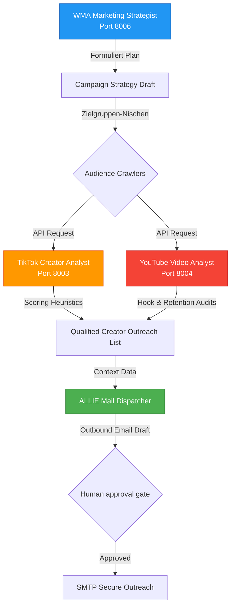

# Marketing & Growth Agents: Dynamische Zielgruppen-Analysen & Outbound-Engagement-Suiten

Dieses Repository-Modul beschreibt die Systemarchitektur der **Wasteland Marketing & Growth Agents**, unserer analytischen Akquise-Schnittstellen.

Die Suite verknüpft strategische Kampagnenentwürfe mit automatisierten Zielgruppen-Crawler-Systemen, lokaler Social-Media-Performance-Bewertung und automatisierten Outreach-Routinen für ein rein datengestütztes Lead-Management.

---

## 1. Architektonische Systemübersicht

Die Marketing- & Growth-Suite arbeitet als geschlossener, kollaborativer Multi-Agenten-Kreislauf, der öffentliche Datenquellen mit semantischem Pattern-Matching, Pitch-Generierung und finanzieller ROI-Erfassung verbindet:



---

## 2. Zentrale Funktionssäulen

### 2.1 WMA (Wasteland Marketing Agent)
Der WMA fungiert als strategischer Marketingleiter des Systems:
* **Kampagnen-Entwicklung**: Formuliert Go-To-Market-Strategien (GTM), Zielgruppensegmente, Mediabudgets und Creative Briefs.
* **Conversion-Funnel-Audits**: Analysiert Webseiten und Conversion-Pfade auf Absprungraten und Reibungspunkte für Besucher.
* **Outbound-Sequenzen**: Definiert zielgerichtete Kommunikationsstrategien für die Ansprache potenzieller B2B-Kunden.

### 2.2 TikTok Creator Analyst
Automatisiert die Identifizierung und Bewertung von Influencer-Kooperationspartnern:
* **Creator-Scoring-Heuristiken**: Bewertet Creator-Profile nach Followerzahlen, durchschnittlichen Interaktionsraten, Kommentarstimmungen und Nischen-Relevanz.
* **Personalisierte Pitch-Generierung**: Erstellt maßgeschneiderte E-Mail- und Direktnachrichten-Entwürfe, die auf dem individuellen Inhaltsstil des Creators basieren.
* **Acquisition-Memory**: Protokolliert historische Outreach-Logs in ChromaDB zur Erkennung der erfolgreichsten Ansprachemuster.

### 2.3 YouTube Video Analyst
Analysiert Video-Strukturen zur Replikation erfolgreicher Formate:
* **Hook- & Pacing-Prüfungen**: Analysiert Videometadaten und Klickkurven und bewertet insbesondere die ersten 30 Sekunden (den Hook) und Inhaltsübergänge.
* **Audience-Retention-Matching**: Gleicht Performance-Kurven mit Trend-Benchmarks ab und liefert Feedback zur Videolänge und Thumbnails.
* **YouTube API-Anbindung**: Interagiert mit API-Schnittstellen zur Überwachung wettbewerbsrelevanter Kanäle.

---

## 3. Abstrahierte Systemimplementierung

Die folgende Python-Struktur veranschaulicht das Zusammenspiel aus Creator-Scoring und automatisierter Outreach-Generierung:

```python
# Marketing & Growth Agents - Scoring & Outreach Generation (Sanitisiertes Modell)

class CreatorScoringEngine:
    def __init__(self, target_niche: str):
        self.niche = target_niche

    def calculate_influencer_score(self, metrics: dict) -> float:
        """Bewertet den Wert des Influencers basierend auf Interaktionsdaten und Nische."""
        followers = metrics.get("followers", 0)
        engagement_rate = metrics.get("engagement_rate", 0.0)  # Z. B. 0.05 für 5%
        niche_match = metrics.get("niche_match_coefficient", 0.0)
        
        # Scoring-Algorithmus
        engagement_score = min(engagement_rate * 100.0, 10.0)  # Max. 10 Punkte
        follower_weight = 0.3 if followers > 100000 else 0.15
        
        score = (engagement_score * 0.4) + (niche_match * 0.4) + (follower_weight * 0.2)
        return float(score)

class OutreachGenerator:
    def generate_pitch(self, creator_name: str, score: float, latest_video_topic: str) -> str:
        """Erstellt personalisierte Pitch-Entwürfe für den Outreach."""
        if score < 0.6:
            return "Outreach abgebrochen: Reifegrad-Score des Creators zu gering."
            
        pitch = (
            f"Betreff: Kooperationsanfrage - Wasteland Interactive\n\n"
            f"Hallo {creator_name},\n\n"
            f"ich habe mir deine Inhalte angesehen und war von deinem neuesten Video zu '{latest_video_topic}' begeistert. "
            f"Deine starke Community-Interaktion passt perfekt zu unseren technischen Standards. "
            f"Wir würden uns freuen, über eine gemeinsame Sponsoring-Kampagne zu sprechen. Lass uns wissen, wenn du offen für ein kurzes Gespräch bist.\n\n"
            f"Viele Grüße,\nALLIE (Outbound Operations Node)"
        )
        return pitch
```

---

## 4. Tech Stack

* **Sprache**: Python 3.11+
* **Plattform-Schnittstellen**: YouTube Data API v3, TikTok Graph API (Sanitisierte Mocks)
* **Vektor-DB**: ChromaDB (Collection: `marketing_acquisition_logs`)
* **Hilfsklassen**: `requests`, `pandas` (Metriken-Analyse), `jinja2` (Template-Engine)

---

## 5. Roadmap

* [x] **Influencer-Scoring-Logik**: Bewertungsmetriken und Mail-Generatoren erfolgreich getestet.
* [x] **API-Aggregatoren**: Robuste Mock-Verbindungen für soziale Netzwerke einsatzbereit.
* [ ] **Automatisches Kampagnen-Tracking (Q2 2026)**: Direkte Verknüpfung der Outreach-Konversionsraten mit den VSA-Finanzmodulen zur Live-Berechnung des ROI.
* [ ] **Mehrsprachige Outreach-Generatoren (Q3 2026)**: Integration lokaler Übersetzungsmodelle zur automatischen Anpassung der Pitch-Texte an internationale Regionen.

---

## 6. Redaction Notice

YouTube- und TikTok-API-Tokens, private E-Mail-Listen von Kooperationspartnern, SMTP-Zugangsdaten der Mailserver und genaue Budgetdaten wurden aus diesem Showcase-Verzeichnis entfernt.
