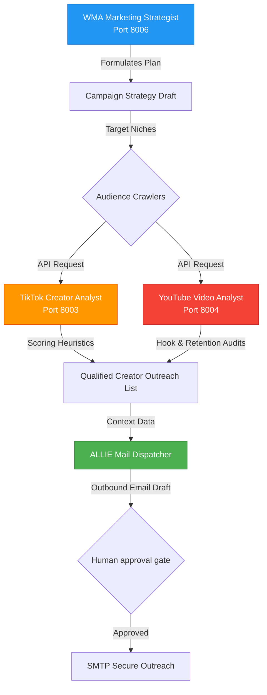

# Marketing & Growth Agents: Dynamic Audience Analytics & Outbound Engagement Suite

This repository module showcases the architectures of the **Wasteland Marketing & Growth Agents**, our analytical acquisition suite. 

By coordinating targeted campaign outlines with dynamic audience crawlers, localized social media performance scoring, and automated outreach engines, the suite scales outreach completely data-driven.

---

## 1. Architectural System Overview

The Marketing & Growth Suite operates as a collaborative multi-agent loop, combining public API aggregators with semantic pattern matching, outreach generation, and financial telemetry:



---

## 2. Core Functional Pillars

### 2.1 WMA (Wasteland Marketing Agent)
The WMA functions as the strategic marketing manager:
* **Strategic Campaigns**: Formulates localized Go-To-Market (GTM) plans, outlining target demographics, ad budgets, and creative briefs.
* **Conversion Funnel Audits**: Crawls marketing landers and analyzes visitor progression indices to detect conversion leakage points.
* **Outbound Outreach Plans**: Directs custom, niche-aligned engagement sequences for prospective enterprise partners.

### 2.2 TikTok Creator Analyst
Automates the discovery and evaluation of influencer partners:
* **Creator-Scoring Heuristics**: Evaluates creator profiles, weighting metrics such as follower counts, average engagement rates, comment sentiments, and niche relevance.
* **Personalized Outreach Generation**: Crafts highly contextual direct-message and email pitches based on the creator's historical content style.
* **Acquisition Memory**: Vectorizes past outreach logs into ChromaDB to identify messaging patterns yielding the highest response rates.

### 2.3 YouTube Video Analyst
Audits video structures to replicate high-retention content:
* **Pacing & Hook Scans**: Analyzes video metadata and performance curves, scoring the first 30 seconds (the hook) and structural pacing transitions.
* **Retention Pattern Matching**: Evaluates video metrics against trending benchmarks to advise on optimal editing cuts, thumbnails, and script lengths.
* **YouTube Data Integration**: Integrates directly with search APIs to monitor competitive channels.

---

## 3. Abstract System Implementation

The following Python script outlines the collaborative creator-scoring and outreach generation workflow:

```python
# Marketing & Growth Agents - Scoring & Outreach Generation (Sanitized Model)

class CreatorScoringEngine:
    def __init__(self, target_niche: str):
        self.niche = target_niche

    def calculate_influencer_score(self, metrics: dict) -> float:
        """Scores creator value based on audience metrics and niche alignment."""
        followers = metrics.get("followers", 0)
        engagement_rate = metrics.get("engagement_rate", 0.0)  # e.g., 0.05 for 5%
        niche_match = metrics.get("niche_match_coefficient", 0.0)
        
        # Scoring heuristic formula
        engagement_score = min(engagement_rate * 100.0, 10.0)  # Capped at 10
        follower_weight = 0.3 if followers > 100000 else 0.15
        
        score = (engagement_score * 0.4) + (niche_match * 0.4) + (follower_weight * 0.2)
        return float(score)

class OutreachGenerator:
    def generate_pitch(self, creator_name: str, score: float, latest_video_topic: str) -> str:
        """Auto-generates highly personalized, non-generic outreach email drafts."""
        if score < 0.6:
            return "Outreach blocked: Creator maturity score too low."
            
        pitch = (
            f"Subject: Collaborative Partnership Proposal - Wasteland Interactive\n\n"
            f"Hello {creator_name},\n\n"
            f"I recently analyzed your content and was thoroughly impressed by your latest video regarding '{latest_video_topic}'. "
            f"Your high audience engagement aligns perfectly with our technical design standards. "
            f"We would love to discuss a structured sponsorship opportunity. Let us know if you're open to a brief chat.\n\n"
            f"Best regards,\nALLIE (Outbound Operations Node)"
        )
        return pitch
```

---

## 4. Tech Stack

* **Language**: Python 3.11+
* **Social APIs**: YouTube Data API v3, TikTok Graph API (Sanitized Mock Connectors)
* **Vector Store**: ChromaDB (Collection: `marketing_acquisition_logs`)
* **Libraries**: `requests`, `pandas` (metric analysis), `jinja2` (pitch templating)

---

## 5. Development Roadmap

* [x] **Influencer Evaluation Logic**: Creator scoring algorithms and pitch generators fully implemented.
* [x] **Data Aggregator Mocks**: Integrated reliable multi-source analytical mock pipelines.
* [ ] **Automated Performance Tracking (Q2 2026)**: Connect outreach metrics directly with VSA valuation modules to dynamically calculate influencer campaign ROI in real-time.
* [ ] **Multilingual Copywriting Engines (Q3 2026)**: Integrate local translation engines to tailor outreach copy to international creator regions.

---

## 6. Redaction Notice

This project module excludes all active YouTube/TikTok API tokens, private outreach email recipient databases, live SMTP host addresses, and proprietary marketing budgets.
