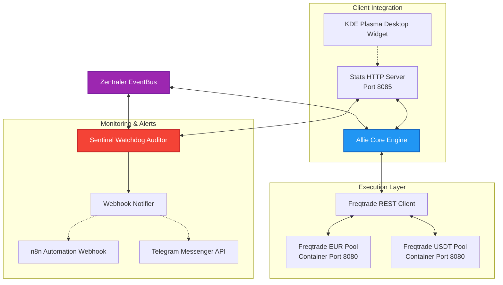

# ALLIE Quant-Trader: Event-gesteuerte Trading-Core-Infrastruktur

Dieses Modul dokumentiert die Architektur und Software-Topologie des **ALLIE Quant-Trading-Cores** – einem vollautomatisierten Multimodul-Trading-Client zur Orchestrierung isolierter Freqtrade-Instanzen, gekoppelt an Echtzeit-Risiko-Watchdogs und ein lokales Desktop-UI-Widget.

Das System arbeitet ausschließlich asynchron über einen zentralen EventBus, um eine strikte Entkopplung zwischen Analyse, Ausführung, Risikoüberwachung und Benutzeroberflächen zu gewährleisten.

---

## 1. Systemübersicht & Datenfluss

Der ALLIE Quant-Trader läuft als containerisierter Daemon im Hintergrund und verbindet quantitative Analyse-Routinen mit dem asynchronen Freqtrade-REST-Client.



---

## 2. Kernkomponenten des Trading-Systems

### 2.1 Allie Core Engine (`core.py`)
Das Herzstück des Trading-Clients. Der Core reagiert auf Commands (`CMD_START_CORE`, `CMD_STOP_CORE`) und steuert den Haupt-Trading-Loop:
* **Market Regime Analysis**: Periodischer Scan von Handelspaaren (z. B. RSI-Metriken, Trend-EMAs) zur Erkennung günstiger Kaufgelegenheiten.
* **Capital Allocation & Routing**: Dynamische Zuordnung von Orders auf den EUR- oder USDT-Pool basierend auf Payout-Milestones und vordefinierten Kapitalgrenzen.
* **Paper-Trading-Schutz**: Eine integrierte Sicherheitsbarriere erzwingt standardmäßig den `PaperTradingWrapper` und verhindert strikt die Verwendung von Live-API-Wrapper-Instanzen im Code.

### 2.2 Sentinel Watchdog Auditor (`sentinel_core.py`)
Ein passiver und aktiver Risiko-Watchdog, der das System in Echtzeit überwacht und Anomalien abfängt.
* **Integrity Guard**: Überprüft kontinuierlich die Datei-Hashwerte wichtiger Konfigurationsdateien (wie `governance.yaml`) auf unautorisierte Änderungen.
* **Reachability Checker**: Prüft alle 5 Sekunden die Erreichbarkeit der Freqtrade REST-Schnittstellen. Bei Verbindungsabbrüchen wird die Fehlerrate inkrementiert.
* **Eskalationsstufen**:
  * **DEGRADED**: Wird aktiviert, wenn Freqtrade temporär unerreichbar ist. Trades werden ausgesetzt, bis die Verbindungen stabil sind.
  * **SAFE_MODE / EMERGENCY_STOP**: Kritische Fehler (z. B. Konfigurations-Manipulation) führen zur sofortigen Schließung aller Positionen und zum Bot-Shutdown.

### 2.3 Webhook Notifier Integration (`webhook_notifier.py`)
Erfasst Status- und Alert-Events vom `EventBus` (wie `NOTIFY_TELEGRAM` und `NOTIFY_PAYOUT`) und leitet diese strukturiert an n8n-Webhook-Endpunkte weiter. Dadurch wird eine sichere, asynchrone Benachrichtigungs-Kette zu Telegram aufgebaut, ohne dass sensible Bot-Token direkt im lokalen Code gespeichert werden müssen.

---

## 3. Asynchrones Sentinel Auto-Recovery (Phase 24 Update)

Um Verbindungsunterbrechungen robust zu handhaben, verfügt der Watchdog über eine automatische Recovery-Schleife:

1. **Failure State**: Wenn der Sentinel-Watchdog Verbindungsfehler zu den Freqtrade-Instanzen erkennt, schaltet er das System in den Zustand `DEGRADED`.
2. **Re-connection**: Sobald beide Freqtrade-Instanzen wieder erfolgreich antworten (`pong`), setzt der Watchdog die Fehlerzähler zurück.
3. **Auto-Transition**: Sentinel sendet ein `CMD_RESUME` Event (um den Core in den betriebsbereiten `IDLE` Zustand zurückzuversetzen) gefolgt von einem `CMD_START_CORE` Event. Der Core nimmt daraufhin vollautomatisch den Betrieb im Zustand `RUNNING` wieder auf.

---

## 4. Docker Orchestrations-Topologie

Die Module laufen isoliert in einem dedizierten Docker-Bridge-Netzwerk. Die Anbindung erfolgt über standardisierte Umgebungsvariablen.

```yaml
# docker-compose.yml (Sanitisiertes Schema)
version: '3.8'

services:
  allie-agent:
    build:
      context: .
      dockerfile: Dockerfile
    container_name: allie-agent
    restart: unless-stopped
    ports:
      - "[HOST_STATS_PORT]:8085"
    environment:
      - RUN_HEADLESS=True
      - STATS_SERVER_HOST=0.0.0.0
      - STATS_SERVER_PORT=8085
      - TELEGRAM_BOT_TOKEN=[REDACTED_TELEGRAM_TOKEN]
      - N8N_PRODUCTION_WEBHOOK=http://n8n-network-bridge:5678/webhook/[REDACTED_UUID]
      - FREQTRADE_EUR_URL=http://ellie_freqtrade_eur:8080
      - FREQTRADE_USDT_URL=http://ellie_freqtrade_usdt:8080
    networks:
      - external-bridge

  freqtrade_eur:
    image: freqtradeorg/freqtrade:stable
    container_name: ellie_freqtrade_eur
    ports:
      - "8081:8080"
    volumes:
      - ./user_data/config_eur.json:/freqtrade/user_data/config.json:ro
    networks:
      - external-bridge

  freqtrade_usdt:
    image: freqtradeorg/freqtrade:stable
    container_name: ellie_freqtrade_usdt
    ports:
      - "8082:8080"
    volumes:
      - ./user_data/config_usdt.json:/freqtrade/user_data/config.json:ro
    networks:
      - external-bridge

networks:
  external-bridge:
    external: true
    name: [REDACTED_EXTERNAL_BRIDGE_NAME]
```

---

## 5. Tech Stack

* **Trading Engine**: Freqtrade, CCXT (Crypto Exchange Calculator)
* **API Framework**: FastAPI, Pydantic, Python HTTP Server (`StatsServer`)
* **Storage**: SQLite (`allie_state.db` zur zustandsbehafteten Transaktionsspeicherung)
* **Monitoring**: Pytest, Custom EventBus Logger
* **Orchestration**: Docker Compose, Systemd (`plasma-plasmashell`)

---

## 6. Redaction Notice

Sämtliche API-Schlüssel, Telegram-Tokens, n8n-Webhook-Pfade, private Netzwerkbrücken-Namen und spezifische Server-IP-Adressen wurden in diesem Dokument und in den Konfigurationen geschwärzt oder durch abstrakte Bezeichner ersetzt. Die quantitativen Handelsstrategien (`HedgefundStrategy`) und mathematischen Indikatorgewichtungen dienen in diesem Showcase ausschließlich Demonstrationszwecken.
