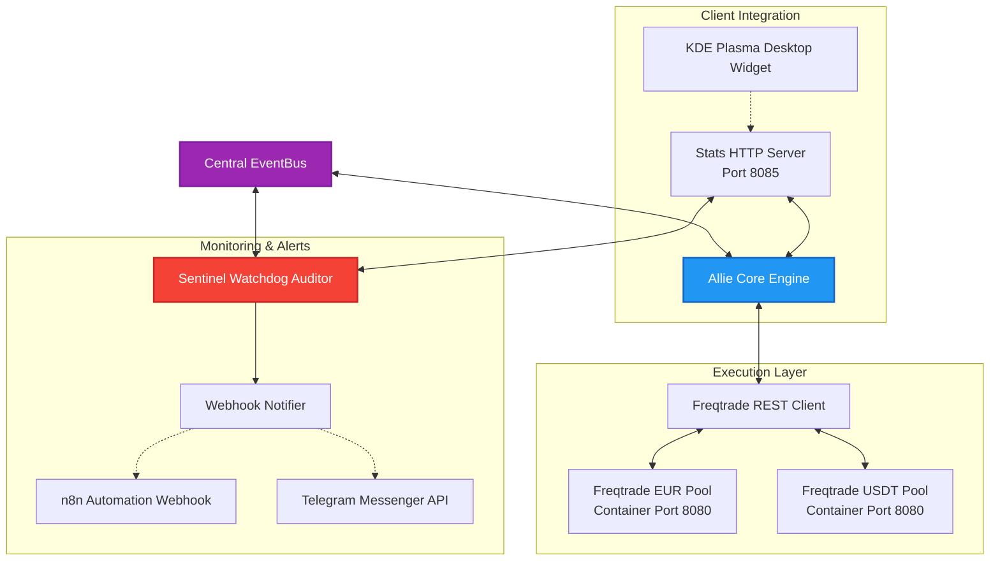

# ALLIE Quant-Trader: Event-Driven Trading Core Infrastructure

This module documents the architecture and software topology of the **ALLIE Quant-Trading Core** – a fully automated multi-module trading client designed to orchestrate isolated Freqtrade instances, coupled with real-time safety watchdogs and a local desktop UI widget.

The system operates strictly asynchronously via a central EventBus to guarantee decoupling between analysis, execution, risk monitoring, and user interfaces.

---

## 1. System Overview & Data Flow

The ALLIE Quant-Trader runs as a containerized background daemon, bridging quantitative analysis routines with the asynchronous Freqtrade REST client.



---

## 2. Core Components of the Trading System

### 2.1 Allie Core Engine (`core.py`)
The heart of the trading client. The Core responds to commands (`CMD_START_CORE`, `CMD_STOP_CORE`) and drives the main trading loop:
* **Market Regime Analysis**: Periodically scans trading pairs (e.g., RSI metrics, trend EMAs) to detect favorable buying opportunities.
* **Capital Allocation & Routing**: Dynamically allocates orders to the EUR or USDT pool based on payout milestones and predefined capital thresholds.
* **Paper Trading Safeguard**: An integrated safety barrier strictly enforces the `PaperTradingWrapper` and prevents the instantiation of live API wrappers in the code.

### 2.2 Sentinel Watchdog Auditor (`sentinel_core.py`)
A passive and active risk watchdog that monitors system health in real-time and intercepts anomalies.
* **Integrity Guard**: Continually monitors the file hash values of critical configuration files (such as `governance.yaml`) for unauthorized modifications.
* **Reachability Checker**: Queries the reachability of the Freqtrade REST APIs every 5 seconds. Connection timeouts increment the error rate.
* **Escalation Levels**:
  * **DEGRADED**: Activated if Freqtrade is temporarily unreachable. Trades are paused until connections stabilize.
  * **SAFE_MODE / EMERGENCY_STOP**: Critical errors (e.g., configuration tampering) trigger immediate position closures and bot shutdown.

### 2.3 Webhook Notifier Integration (`webhook_notifier.py`)
Captures status and alert events from the `EventBus` (such as `NOTIFY_TELEGRAM` and `NOTIFY_PAYOUT`) and forwards them to n8n webhook endpoints. This establishes a secure, asynchronous alert chain to Telegram without storing sensitive bot tokens directly in the trading codebase.

---

## 3. Asynchronous Sentinel Auto-Recovery

To handle connection drops robustly, the watchdog features an automated recovery loop:

1. **Failure State**: When the Sentinel watchdog detects connection issues with Freqtrade instances, it transitions the system to the `DEGRADED` state.
2. **Re-connection**: Once both Freqtrade instances respond successfully (`pong`), the watchdog resets the error counters.
3. **Auto-Transition**: Sentinel publishes a `CMD_RESUME` event (to return the Core to the operational `IDLE` state), followed by a `CMD_START_CORE` event. The Core then automatically resumes trading in the `RUNNING` state.

---

## 4. Docker Orchestration Topology

The modules run isolated in a dedicated Docker bridge network. Connections are configured using standardized environment variables.

```yaml
# docker-compose.yml (Sanitized Schema)
version: '3.8'

services:
  allie-agent:
    build:
      context: .
      dockerfile: Dockerfile
    container_name: allie-agent
    restart: unless-stopped
    ports:
      - "[HOST_STATS_PORT]:8085"
    environment:
      - RUN_HEADLESS=True
      - STATS_SERVER_HOST=0.0.0.0
      - STATS_SERVER_PORT=8085
      - TELEGRAM_BOT_TOKEN=[REDACTED_TELEGRAM_TOKEN]
      - N8N_PRODUCTION_WEBHOOK=http://n8n-network-bridge:5678/webhook/[REDACTED_UUID]
      - FREQTRADE_EUR_URL=http://ellie_freqtrade_eur:8080
      - FREQTRADE_USDT_URL=http://ellie_freqtrade_usdt:8080
    networks:
      - external-bridge

  freqtrade_eur:
    image: freqtradeorg/freqtrade:stable
    container_name: ellie_freqtrade_eur
    ports:
      - "8081:8080"
    volumes:
      - ./user_data/config_eur.json:/freqtrade/user_data/config.json:ro
    networks:
      - external-bridge

  freqtrade_usdt:
    image: freqtradeorg/freqtrade:stable
    container_name: ellie_freqtrade_usdt
    ports:
      - "8082:8080"
    volumes:
      - ./user_data/config_usdt.json:/freqtrade/user_data/config.json:ro
    networks:
      - external-bridge

networks:
  external-bridge:
    external: true
    name: [REDACTED_EXTERNAL_BRIDGE_NAME]
```

---

## 5. Tech Stack

* **Trading Engine**: Freqtrade, CCXT (Crypto Exchange Calculator)
* **API Framework**: FastAPI, Pydantic, Python HTTP Server (`StatsServer`)
* **Storage**: SQLite (`allie_state.db` for transactional state persistence)
* **Monitoring**: Pytest, Custom EventBus Logger
* **Orchestration**: Docker Compose, Systemd (`plasma-plasmashell`)

---

## 6. Redaction Notice

All API keys, Telegram tokens, n8n webhook paths, private network bridge names, and specific server IP addresses have been redacted or replaced with abstract identifiers. The quantitative trading strategies (`HedgefundStrategy`) and mathematical indicator weights are used purely for demonstration purposes in this showcase.
