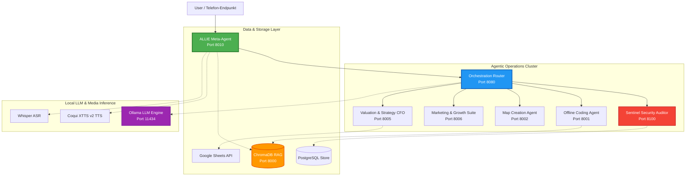

# Wasteland Interactive: Multi-Agenten-KI-Ökosystem & Software-Architektur-Showcase

Willkommen im offiziellen Software-Architektur-Showcase von **Wasteland Interactive**.

Dieses Repository dient als professionelles Engineering-Portfolio zur Demonstration tiefgehender Kompetenzen in den Bereichen **KI-Infrastruktur, agentische Workflows, Multi-Agenten-Orchestrierung und Fullstack-Entwicklung**. Es bietet einen fundierten technischen Einblick in unsere internen Automatisierungs-Systeme, Agenten-Frameworks und Software-Suiten.

> [!NOTE]
> **HINWEIS ZUM SCHUTZ VON BETRIEBSGEHEIMNISSEN & IP**
> Zum Schutz unserer IP, unserer Sicherheitsbarrieren und der operativen Integrität wurden sämtliche produktiven Quellcodes, privaten Systemprompts, Zugangsdaten, API-Endpunkte und rohen Konfigurationen bereinigt, abstrahiert oder geschwärzt. Dieses Showcase ist gezielt darauf ausgelegt, **architektonische Tiefe, sauberes Systemdesign und Engineering-Exzellenz** zu vermitteln, ohne betriebsrelevante Systeme zu gefährden.

---

## Technische Topologie des Ökosystems

Das folgende Diagramm veranschaulicht das entkoppelte Multi-Agenten-Netzwerk, die Datenströme und die Infrastruktur-Brücken der Wasteland Interactive-Architektur:

---

## Showcase-Verzeichnis

Das Ökosystem ist in **8 dokumentierte Projekt-Module** unterteilt, die jeweils einen spezifischen Schwerpunkt unserer Entwicklung und KI-Orchestrierung repräsentieren:

1. **[01_wasteland-core-framework](01_wasteland-core-framework/README_DE.md)**
   * **Schwerpunkt**: Workflow-Ausführungsgrenzen, Berechtigungsmodelle und Human-in-the-Loop-Prozesse (HITL).
2. **[02_allie-meta-orchestrator](02_allie-meta-orchestrator/README_DE.md)**
   * **Schwerpunkt**: Sprach-IVR-Telefonie-Integration (Asterisk SIP/PJSIP), personalisierte XTTS-Sprachsynthese, E-Mail-Parsing und Multi-Agenten-Steuerung.
3. **[03_sentinel-security-auditor](03_sentinel-security-auditor/README_DE.md)**
   * **Schwerpunkt**: Automatisierte Schwachstellen-Scans, SaaS-Abrechnungs-Schnittstellen, passive Sicherheitsaudits, GDPR-konforme Daten-Gates und ein System-Schweregrad-Eskalationssystem.
4. **[04_offline-coding-agent](04_offline-coding-agent/README_DE.md)**
   * **Schwerpunkt**: Hochleistungsfähige, lokale GPU-gestützte Code-Inferenz (`DeepSeek-Coder-33B`), RAG-gestützte Code-Wissensdatenbanken und native VS-Code-Integration.
5. **[05_map-creation-agent](05_map-creation-agent/README_DE.md)**
   * **Schwerpunkt**: Bildverarbeitungs- und OCR-gestützte GUI-Automatisierung proprietärer 3D-Software (World Creator), sichere Betriebssystem-Control-Wrapper und Generierung von Höhendaten.
6. **[06_business-suite-frontend](06_business-suite-frontend/README_DE.md)**
   * **Schwerpunkt**: Performante Vanilla-Frontend-Entwicklung, Lighthouse-Score-Optimierung (95+), barrierefreie CI/CD-Pipelines, PWA-Funktionen und automatisierte Releases.
7. **[07_valuation-strategy-agent](07_valuation-strategy-agent/README_DE.md)**
   * **Schwerpunkt**: CFO-Analysetool, automatisierte Generierung von Startup-Scorecards, Low-/Base-/High-Unternehmensbewertungsmodelle und Google-Sheets-Exporte.
8. **[08_marketing-growth-agents](08_marketing-growth-agents/README_DE.md)**
   * **Schwerpunkt**: Zielgruppen-Analysetools, automatisiertes Social-Media-Performance-Scoring (YouTube, TikTok) und Outreach-Systeme.
9. **[09_allie-quant-trader](09_allie-quant-trader/README_DE.md)**
   * **Schwerpunkt**: EventBus-Architektur, Sentinel-Watchdog, API-Integrationen mit Freqtrade-Instanzen, automatische Wiederherstellungsschleifen und lokale Desktop-UI-Widgets.

Für eine vollständige Übersicht über alle erkannten Projekte, Pfade und den Redaction-Status lesen Sie das **[PROJECT_INDEX.md](PROJECT_INDEX.md)**.

---

## Kerntechnologien & Infrastruktur

Wir setzen konsequent auf selbstgehostete, offline-fähige und containerisierte Komponenten, um die vollständige Datenhoheit zu gewährleisten:

| Ebene | Verwendeter Tech Stack | Besondere Fähigkeiten |
| :--- | :--- | :--- |
| **Orchestration Core** | Python, FastAPI, Pydantic | Intelligente Intent-Klassifizierungs-Router, asynchrone Event-Verteilung, API-Gateways mit Rate-Limiting. |
| **Lokale LLM-Inferenz** | Ollama, `llama.cpp`, NVIDIA CUDA | Offline-Ausführung quantisierter Open-Source-Modelle (`llama3:8b`, `mistral:7b`, `DeepSeek-Coder-33B`). |
| **Vektorsuche (RAG)** | ChromaDB, SentenceTransformers | Lokale Vektordatenbanken, automatisierte Ingestion-Pipelines und kontextbasierter Cache. |
| **Medien & Telefonie** | Asterisk, PJSIP, Coqui XTTS v2, Whisper | Echtzeit-SIP-VoIP-Anbindungen, eigene Sprach-Embedding-Synthesen, transkriptionsgestützte Mailbox-Systeme. |
| **Security & Operations** | Docker Compose, PostgreSQL, Nmap, Nikto, OWASP ZAP | Isolierte Bridge-Netzwerke, mehrstufige Container-Builds (Docker Multi-Stage), mandantenfähige Datenbanken. |
| **Frontend-Suite** | HTML5, CSS3 (Vanilla), JavaScript (ESNext), cssnano, terser | Progressive Web Applications (PWA), Service Worker Caching, Lighthouse-CI, semantische SEO-Strukturen. |

---

## Technische Kompetenzen & Engineering-Highlights

Dieses Ökosystem demonstriert zentrale softwarearchitektonische Paradigmen unter realen Bedingungen:

* **Sovereign AI Infrastructure**: Aufbau von hochgradig GPU-beschleunigten Inferenz-Clustern für den lokalen Betrieb von LLMs. Dadurch entfallen wiederkehrende SaaS-API-Kosten und das Risiko von Datenabflüssen an Drittanbieter wird eliminiert.
* **Komplexe Systemintegration**: Die Verknüpfung historisch gewachsener Telefonie-Infrastrukturen (Asterisk) mit modernster Sprachgenerierung (XTTS v2) und dynamischem Intent-Routing zu einer intelligenten Conversational UI.
* **Sichere, kontrollierte Agentic-Workflows**: Durchsetzung klarer Sicherheitsbarrieren. KI-Agenten agieren in abgeschotteten Workspaces und können Code-Änderungen oder Deployments erst nach Bestehen automatisierter QA-Gates, Security-Scans und menschlicher Freigaben ausführen.
* **Computer-Vision-gestützte Automatisierung**: Entwicklung von visuellen Navigations- und Interaktionsroutinen unter Verwendung von DirectX-Screenshot-Bibliotheken und OCR-Erkennung (Tesseract), um API-lose 3D-Software sicher und robust fernzusteuern.
* **Automatisierte Qualitäts-Gates**: Integration von automatisierten Lighthouse-Performance-Tests, Accessibility-Audits und robusten Deployment-Routinen in die Fullstack-Entwicklung.

---

## Schwärzungs- und Schutzstrategie (Redaction Notice)

Dieses Repository folgt einer proaktiven **Schutz- und Anonymisierungsstrategie**, die im Detail unter **[REDACTION_NOTICE_DE.md](REDACTION_NOTICE_DE.md)** beschrieben ist.
Wir betrachten den Schutz unserer produktiven Infrastruktur als Zeichen professioneller Reife. Zur Veranschaulichung der Systemkomplexität nutzen wir UML-Diagramme, Sequenzdiagramme und abstrakte Strukturdefinitionen:

* **Sanitierung von Secrets**: Keine Live-Tokens, privaten Mail-Konfigurationen oder aktiven SIP-Registrierungen.
* **Abstrakte Konfigurationen**: Docker-Compose-Dateien und System-Routen nutzen standardisierte Platzhalter.
* **Pseudocode statt IP-Leaking**: Kern-Algorithmen (wie die Berechnungslogik der Unternehmensbewertung oder UI-Fixes) sind als saubere, verständliche Python-Pseudocode-Strukturen abgebildet.

---

Für direkte Anfragen an unsere Entwickler, Systemarchitekten oder das Management nutzen Sie bitte das [Wasteland Interactive Kontaktformular](https://wasteland-interactive.de).
