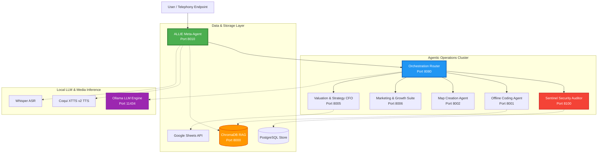

# Wasteland Interactive: Multi-Agent AI Ecosystem & Software Architecture Showcase

Welcome to the public software architecture showcase of **Wasteland Interactive**. 

This repository serves as a professional portfolio illustrating core competencies in **AI Infrastructure, Agentic Workflows, Multi-Agent Orchestration, and Fullstack Engineering**. It provides a high-level technical overview of our internal automation engine, agent frameworks, and custom software systems.

> [!NOTE]
> **SOCIETY & SECURITY PRESERVATION NOTICE**
> To protect company IP, security boundaries, and operational integrity, all productive source code, private prompts, credentials, API endpoints, and raw configurations have been sanitized, abstracted, or redacted. This showcase is designed to demonstrate **architectural depth, clean system design, and engineering excellence** without exposing operational systems.

---

## Technical Ecosystem Topology

The following diagram illustrates the decoupled multi-agent network, data routes, and infrastructure bridges of the Wasteland Interactive architecture:

---

## Showcase Index

The ecosystem is divided into **8 documented project modules**, each showcasing a distinct area of fullstack development and AI orchestration:

1. **[01_wasteland-core-framework](01_wasteland-core-framework/README_EN.md)**
   * **Focus**: Workflow execution boundaries, permission models, and human-in-the-loop (HITL) compliance.
2. **[02_allie-meta-orchestrator](02_allie-meta-orchestrator/README_EN.md)**
   * **Focus**: Voice IVR telephony integration (Asterisk SIP/PJSIP), custom voice clone pipelines, email parsing, and multi-agent coordination.
3. **[03_sentinel-security-auditor](03_sentinel-security-auditor/README_EN.md)**
   * **Focus**: Automated vulnerability scanning, SaaS billing integrations, passive security auditing, GDPR data lifecycle gates, and a system severity level escalation engine.
4. **[04_offline-coding-agent](04_offline-coding-agent/README_EN.md)**
   * **Focus**: High-performance local GPU code intelligence models (`DeepSeek-Coder-33B`), RAG-assisted context generation, and VS Code integration.
5. **[05_map-creation-agent](05_map-creation-agent/README_EN.md)**
   * **Focus**: Computer-vision and OCR-based GUI software automation (World Creator), secure OS control wrappers, and spatial data generation.
6. **[06_business-suite-frontend](06_business-suite-frontend/README_EN.md)**
   * **Focus**: Vanilla high-performance frontend engineering, Lighthouse 95+ score optimization, automated accessibility pipelines, PWA integration, and automated deployments.
7. **[07_valuation-strategy-agent](07_valuation-strategy-agent/README_EN.md)**
   * **Focus**: CFO analytical engine, automated startup scorecard generation, base/low/high valuation models, and dynamic business data aggregation.
8. **[08_marketing-growth-agents](08_marketing-growth-agents/README_EN.md)**
   * **Focus**: Audience analytics tools, automated social media performance tracking (YouTube, TikTok), and outbound outreach engines.
9. **[09_allie-quant-trader](09_allie-quant-trader/README_EN.md)**
   * **Focus**: EventBus architecture, Sentinel watchdog supervision, API client integrations with Freqtrade instances, auto-recovery loops, and local desktop UI widgets.

Refer to the complete directory index in **[PROJECT_INDEX.md](PROJECT_INDEX.md)** for details on source paths, metadata status, and redaction flags.

---

## Core Technologies & Infrastructure

Our systems prioritize self-hosted, offline, and containerized components to guarantee complete data sovereignty:

| Layer | Primary Tech Stack | Highlight Capabilities |
| :--- | :--- | :--- |
| **Orchestration Core** | Python, FastAPI, Pydantic | Intent classification routers, async events routing, rate-limiting, stateless API gateways. |
| **Local LLM Inference** | Ollama, `llama.cpp`, NVIDIA CUDA | Offline execution of quantized models (`llama3:8b`, `mistral:7b`, `DeepSeek-Coder-33B`). |
| **Vector Search (RAG)** | ChromaDB, SentenceTransformers | Embedded vector stores, localized document ingestion pipelines, contextual caching. |
| **Media & Telephony** | Asterisk, PJSIP, Coqui XTTS v2, Whisper | Real-time SIP VoIP endpoints, personal TTS voice model embeddings, low-latency audio stream processing. |
| **Security & Operations** | Docker Compose, PostgreSQL, Nmap, Nikto, OWASP ZAP | Isolated bridge network topographies, multi-stage secure container builds, tenant-segregated databases. |
| **Frontend Suite** | HTML5, CSS3 (Vanilla), JavaScript (ESNext), cssnano, terser | Progressive Web Applications (PWA), Service Worker caching, automated Lighthouse CI, SEO schemas. |

---

## Professional Highlights & Key Competencies

Through this architecture, Wasteland Interactive demonstrates several fundamental software engineering paradigms:

* **Sovereign AI Infrastructure**: Designing high-throughput GPU-accelerated computing nodes capable of hosting massive LLMs completely offline, eliminating SaaS recurring API costs and data privacy leakage.
* **Complex System Integration**: Integrating legacy VoIP telephony infrastructure (Asterisk) with bleeding-edge voice synthesis models (XTTS v2) and dynamic intent classification routers to form human-grade conversational interfaces.
* **Secure Agentic Workflows**: Enforcing strict, automated validation boundaries where AI agents can only modify code or deploy files after passing multi-tiered QA checks, security scanners, and human approval gates.
* **Vision-Based Automation**: Building sophisticated visual navigation systems using Computer Vision and OCR fallbacks to programmatically interact with proprietary, non-API 3D rendering and landscape design software.
* **Fullstack Lifecycle Engineering**: Orchestrating performance-optimized, highly accessible frontends with automated quality gates and structural CI/CD deployment pipelines.

---

## Showcase Redaction Strategy

This repository uses a proactive **Redaction & Sanitization Strategy** described in detail in **[REDACTION_NOTICE_EN.md](REDACTION_NOTICE_EN.md)**. 
We believe that protecting operational infrastructure is a sign of engineering maturity. Our approach abstracts concrete internal details into robust UML diagrams, system sequence diagrams, and high-level architectural schemas:

* **IP Sanitization**: No active server tokens, private email servers, or live SIP registrations.
* **Abstract Configuration**: Docker Compose files and system routes use standardized placeholder boundaries.
* **Procedural Logic**: Key algorithms (like valuation or level fix routines) are represented via clean Pythonic pseudocode rather than raw proprietary codebases.

---

For direct developer, architect, or founder inquiries, please reach out via [Wasteland Interactive Contact](https://wasteland-interactive.de).
