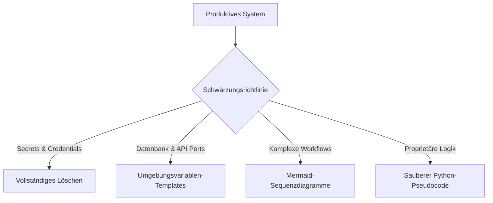

# Richtlinie zur Operational Security & Schwärzung von geistigem Eigentum

Um die Einhaltung unserer Sicherheitsrichtlinien zu gewährleisten und die operative Integrität zu wahren, wurde dieses Architektur-Showcase unter Einhaltung einer strengen **Sanitisierungs- & Schwärzungsrichtlinie** aufbereitet.

Dieses Dokument erläutert, welche Informationen entfernt wurden, wie der technische Wert der Dokumentation erhalten blieb und wie autorisierte Personen (z. B. technische Auditoren oder potenzielle Partner) Zugang zu verifizierten Systemdemonstrationen beantragen können.

---

## 1. Umfang geschwärzter Informationen

Die folgenden Informationen wurden in allen Dateien dieses Repositories systematisch entfernt, maskiert oder abstrahiert:

* **Authentifizierung & Zugangsdaten**:
  * Keine Datenbank-Passwörter, Verschlüsselungs-Keys oder gesalzenen Passwort-Hashes (z. B. bcrypt-Blöcke).
  * Keine privaten OAuth-Tokens, aktiven API-Zugangsdaten oder Webhook-Secret-HMAC-Tokens.
  * Keine SIP-Trunk-Zugangsdaten oder Registrierungs-Secrets.
* **Netzwerk- & Host-Informationen**:
  * Sämtliche statischen, öffentlichen IP-Adressen wurden durch standardisierte Platzhalter ersetzt (z. B. `[IP GESCHWÄRZT]` oder lokale Loopback-Muster).
  * Domain-Namen, interne E-Mail-Server (SMTP/IMAP) und Port-Freigaben wurden in allgemeine Netzwerk-Topologien überführt.
* **Proprietärer Quellcode & Kernlogiken**:
  * Kein roher, produktiver Quellcode in Python, JavaScript oder C#.
  * Interna proprietärer Algorithmen (z. B. die exakten mathematischen Gewichtungen der VSA-Bewertungs-Engine, dynamische Bedrohungs-Heuristiken oder spezifische DirectX-Memory-Offsets) wurden verallgemeinert.
* **Systemprompts & Vertrauliche SOPs**:
  * Die echten, operativen Systemprompts unserer KI-Agenten wurden geschützt. Sie sind durch strukturelle Beispiele abgebildet, die den Verarbeitungsfluss zeigen, nicht aber den exakten, internen Prompt-Text.
* **Identitäten & Personenbezogene Daten**:
  * Namen von Entwicklern, interne Pfade auf Entwicklungsgeräten, Kundendaten und Anruf-Protokolle wurden vollständig anonymisiert.

---

## 2. Erhalt des technischen Dokumentationswertes

Wir sind der festen Überzeugung, dass ein erstklassiges Engineering-Portfolio **strukturelle Klarheit, architektonische Stringenz und Systemintegrations-Kompetenz** aufzeigen sollte – nicht bloßen Rohcode.

Um den Wert für Recruiter, Architekten und technische Experten zu maximieren, wurden folgende Abstraktionsverfahren angewendet:

* **Modellierung durch Mermaid**: Dynamische Interaktionen zwischen Agenten, Telefonie-Routing-Prozesse und GDPR-Compliance-Gates sind als interaktive Sequenzdiagramme in Markdown visualisiert.
* **Sauberer Python-Pseudocode**: Komplexe funktionale Ebenen (wie die visuelle OCR-Klickvalidierung oder die mandantenfähige Abrechnungslogik) sind als verständlicher Pseudocode abgebildet, der die exakten Programmierparadigmen aufzeigt.
* **Strukturierte Docker-Compose-Vorlagen**: Die Konfigurationsdateien wurden in ihrer vollen Struktur erhalten, nutzen jedoch Umgebungsvariablen (`.env`), um das Netzwerkzusammenspiel ohne Hardcoding operativer Werte darzustellen.

---

## 3. Autorisierter Zugang & Verifizierbare Audits

Potenzielle Partner, Technische Leiter (CTOs) und Personalverantwortliche können unter Einhaltung einer entsprechenden Vertraulichkeitsvereinbarung (NDA) eine sichere Live-Demonstration unserer Systeme anfordern.

### Verfügbare verifizierbare Nachweise:
1. **Live-SIP/VoIP-Demonstration**: Wählen Sie sich direkt in unser aktives ALLIE-Meta-Agenten-Cluster ein und interagieren Sie in Echtzeit mit unserem XTTS-Sprachmodell.
2. **Sentinel-Sicherheitsaudits**: Einsehen realer PDF- und JSON-Sicherheitsberichte, die in Staging-Netzwerken erzeugt wurden.
3. **Map-Agent-Visualisierung**: Videoaufzeichnungen des visuellen Map-Erstellungs-Workflows, in dem die GUI-Steuerung Höhendaten vollautomatisch aus World Creator exportiert.

Bei Fragen zu diesen Architekturen oder für die Beantragung einer autorisierten Session wenden Sie sich bitte an den [Wasteland Interactive Kontakt](https://wasteland-interactive.de).
