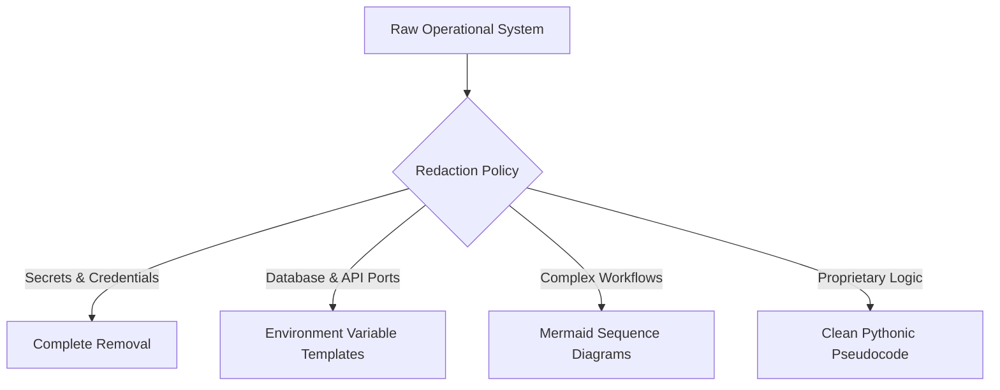

# Operational Security & Intellectual Property Redaction Notice

To ensure compliance with corporate security rules and preserve operational integrity, this architecture showcase has been processed under a strict **Sanitization & Redaction Policy**. 

This document explains what information was removed, how the technical value was preserved, and how authorized personnel (such as technical auditors or prospective partners) may request access to verified evaluations.

---

## 1. Scope of Redacted Information

The following items have been systematically removed, masked, or abstracted across all files in this repository:

* **Authentication & Credentials**:
  * No database passwords, encryption keys, or salted password hashes (e.g., bcrypt blocks).
  * No private OAuth tokens, active API credentials, or webhook secret HMAC tokens.
  * No SIP trunk authentication details or registrar credentials.
* **Network & Host Information**:
  * All public static IP addresses are replaced with standard system boundaries (e.g., `[IP REDACTED]` or local loopback patterns).
  * Domain routing names, internal mail servers (SMTP/IMAP configurations), and port mappings are mapped using general network topologies.
* **Proprietary Codebases & Logic**:
  * No raw production Python, JavaScript, or C# code.
  * Internal algorithm specifics (e.g., the exact coefficients of the VSA valuation engine, dynamic threat heuristic scorers, or custom DirectX memory offsets) have been generalized.
* **System Prompts & Private SOPs**:
  * Actual, raw system prompts and proprietary agent behaviors are protected. They are represented by structural examples demonstrating the pipeline rather than the active operational text.
* **Identity & Personal Data**:
  * Names, internal developer directories, customer details, and telephony logs are anonymized.

---

## 2. Technical Value Preservation Strategy

We believe a premium engineering portfolio should showcase **structural clarity, architectural rationale, and systems integration expertise** rather than raw code. 

To maintain maximum value for recruiters, architects, and technical professionals, we have applied several preservation strategies:

* **Mermaid Workflow Modeling**: Dynamic agent communications, telephony routing pipelines, and GDPR compliance logic are mapped out via fully interactive Markdown sequence diagrams.
* **Pythonic Pseudocode**: Complex functional layers (such as OCR click validation or multi-tenant billing logic) are written in clean, readable Python pseudocode showing exact software architectural concepts.
* **Docker Compose Templates**: Orchestration files are kept fully structured but utilize environment variables (`.env` declarations) to show how containers interact on the network without exposing hardcoded environment values.

---

## 3. Authorized Access & Verifiable Audits

Prospective partners, technology officers, and hiring leads may request a secure, live demonstration of our systems under an appropriate Non-Disclosure Agreement (NDA). 

### Available Verifiable Benchmarks:
1. **Live SIP/VoIP Demonstration**: Dial into our active Allie Meta-Agent cluster and interact with our low-latency XTTS v2 voice model.
2. **Sentinel Passive Auditing Reports**: Inspect actual PDF and JSON vulnerability scans generated on staging networks.
3. **Map Creation Runtime Footage**: Video recordings showing visual automation executing and exporting raw heightmaps from World Creator without human intervention.

For questions regarding these architectures or to request an authorized session, please reach out via [Wasteland Interactive Contact](https://wasteland-interactive.de).
